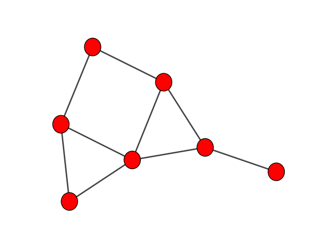
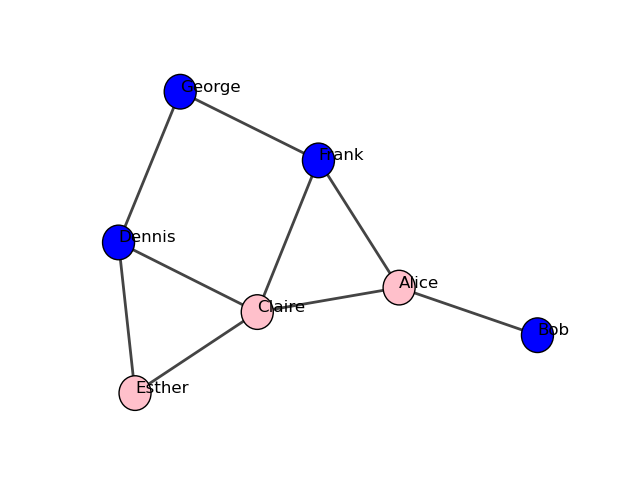

.. include:: include/global.rst

.. _tutorial_es:

.. currentmodule:: igraph

==================
Tutorial (Español)
==================

Esta página es un tutorial detallado de las capacidades de |igraph| para Python. Para obtener una impresión rápida de lo que |igraph| puede hacer, consulte el :doc:`tutorials/quickstart`. Si aún no ha instalado |igraph|, siga las instrucciones de :doc:`install`.

.. note::
   Para el lector impaciente, vea la página :doc:`tutorials/index` para ejemplos cortos y autocontenidos.

Comenzar con |igraph|
=====================

La manera más común de usar |igraph| es como una importanción con nombre dentro de un ambiente de Python (por ejemplo, un simple shell de Python, a `IPython`_ shell, un `Jupyter`_ notebook o una instancia JupyterLab, `Google Colab <https://colab.research.google.com/>`_, o un `IDE <https://www.spyder-ide.org/>`_)::

  $ python
  Python 3.9.6 (default, Jun 29 2021, 05:25:02)
  [Clang 12.0.5 (clang-1205.0.22.9)] on darwin
  Type "help", "copyright", "credits" or "license" for more information.
  >>> import igraph as ig

Para llamar a funciones, es necesario anteponerles el prefijo ``ig`` (o el nombre que hayas elegido)::

  >>> import igraph as ig
  >>> print(ig.__version__)
  0.9.8

.. note::
   Es posible utilizar *importación con asterisco* para |igraph|::

    >>> from igraph import *

   pero en general se desaconseja <https://stackoverflow.com/questions/2386714/why-is-import-bad>`_.

Hay una segunda forma de iniciar |igraph|, que consiste en llamar al script :command:`igraph` desde tu terminal::

  $ igraph
  No configuration file, using defaults
  igraph 0.9.6 running inside Python 3.9.6 (default, Jun 29 2021, 05:25:02)
  Type "copyright", "credits" or "license" for more information.
  >>>

.. note::
   Para los usuarios de Windows encontrarán el script dentro del subdirectorio file:`scripts`
   de Python y puede que tengan que añadirlo manualmente a su ruta.

Este script inicia un intérprete de comandos apropiado (`IPython`_ o `IDLE <https://docs.python.org/3/library/idle.html>`_ si se encuentra, de lo contrario un intérprete de comandos Python puro) y utiliza *importación con asterisco* (véase más arriba). Esto es a veces conveniente para usar las funciones de |igraph|.

.. note::
   Puede especificar qué shell debe utilizar este script a través
   :doc:`configuration` de |igraph|.

Este tutorial asumirá que has importado igraph usando el de nombres ``ig``.

Creando un grafo
================

La forma más sencilla de crear un grafo es con el constructor :class:`Graph`. Para hacer un grafo vacío:

  >>> g = ig.Graph()

Para hacer un grafo con 10 nodos (numerados ``0`` to ``9``) y dos aristas que conecten los nodos ``0-1`` y ``0-5``::

  >>> g = ig.Graph(n=10, edges=[[0, 1], [0, 5]])

Podemos imprimir el grafo para obtener un resumen de sus nodos y aristas::

  >>> print(g)
  IGRAPH U--- 10 2 --
  + edges:
  0--1 0--5

Tenemos entonces: grafo no dirigido (**U**ndirected) con **10** vértices y **2** aristas, que se enlistan en la última parte. Si el grafo tiene un atributo "nombre", también se imprime.

.. note::
   ``summary`` es similar a ``print`` pero no enlista las aristas, lo cual
   es conveniente para grafos grandes con millones de aristas::

     >>> summary(g)
     IGRAPH U--- 10 2 --

Añadir y borrar vértices y aristas
==================================

Empecemos de nuevo con un grafo vacío. Para añadir vértices a un grafo existente, utiliza :meth:`Graph.add_vertices`::

  >>> g = ig.Graph()
  >>> g.add_vertices(3)

En |igraph|, los vértices se numeran siempre a partir de cero El número de un vértice es el *ID del vértice*. Un vértice puede tener o no un nombre.

Del mismo modo, para añadir aristas se utiliza :meth:`Graph.add_edges`::

  >>> g.add_edges([(0, 1), (1, 2)])

Las aristas se añaden especificando el vértice origen y el vértice destino de cada arista. Esta llamada añade dos aristas, una que conecta los vértices ``0`` y ``1``, y otra que conecta los vértices ``1`` y ``2``. Las aristas también se numeran a partir de cero (el *ID del arista*) y tienen un nombre opcional.

.. warning::

  Crear un grafo vacío y añadir vértices y aristas como se muestra aquí puede ser mucho más lento que crear un grafo con sus vértices y aristas como se ha demostrado anteriormente. Si la velocidad es una preocupación, deberías evitar especialmente añadir vértices y aristas *de uno en uno*. Si necesitas hacerlo de todos modos, puedes usar :meth:`Graph.add_vertex` y :meth:`Graph.add_edge`.

Si intentas añadir aristas a vértices con IDs no válidos (por ejemplo, intentas añadir una arista al vértice ``5`` cuando el grafo sólo tiene tres vértices), obtienes un error :exc:`igraph.InternalError`::

  >>> g.add_edges([(5, 4)])
  Traceback (most recent call last):
    File "<stdin>", line 1, in <module>
    File "/usr/lib/python3.10/site-packages/igraph/__init__.py", line 376, in add_edges
      res = GraphBase.add_edges(self, es)
  igraph._igraph.InternalError: Error at src/graph/type_indexededgelist.c:270: cannot add edges. -- Invalid vertex id

El mensaje intenta explicar qué ha fallado (``cannot add edges. -- Invalid
vertex id``) junto con la línea correspondiente del código fuente en la que se ha producido el error.

.. note::
   El rastreo completo, incluida la información sobre el código fuente, es útil cuando
   se informa de errores en nuestro
   `Página de problemas de GitHub <https://github.com/igraph/python-igraph/issues>`_. Por favor, inclúyalo
   completo si crea un nuevo asunto.

Añadamos más vértices y aristas a nuestro grafo::

  >>> g.add_edges([(2, 0)])
  >>> g.add_vertices(3)
  >>> g.add_edges([(2, 3), (3, 4), (4, 5), (5, 3)])
  >>> print(g)
  IGRAPH U---- 6 7 --
  + edges:
  0--1 1--2 0--2 2--3 3--4 4--5 3--5

Ahora tenemos un grafo no dirigido con 6 vértices y 7 aristas. Los IDs de los vértices y aristas son siempre *continuos*, por lo que si eliminas un vértice todos los vértices subsiguientes serán renumerados. Cuando se renumera un vértice, las aristas **no** se renumeran, pero sí sus vértices de origen y destino. Utilice :meth:`Graph.delete_vertices` y :meth:`Graph.delete_edges` para realizar estas operaciones. Por ejemplo, para eliminar la arista que conecta los vértices ``2-3``, obten sus IDs y luego eliminalos::

  >>> g.get_eid(2, 3)
  3
  >>> g.delete_edges(3)

Generar grafos
==============

|igraph| incluye generadores de grafos tanto deterministas como estocásticos. Los generadores *deterministas* producen el mismo grafo cada vez que se llama a la función, por ejemplo::

  >>> g = ig.Graph.Tree(127, 2)
  >>> summary(g)
  IGRAPH U--- 127 126 --

Utiliza :meth:`Graph.Tree` para generar un grafo regular en forma de árbol con 127 vértices, cada vértice con dos hijos (y un padre, por supuesto). No importa cuántas veces llames a :meth:`Graph.Tree`, el grafo generado será siempre el mismo si utilizas los mismos parámetros::

  >>> g2 = ig.Graph.Tree(127, 2)
  >>> g2.get_edgelist() == g.get_edgelist()
  True

El fragmento de código anterior también muestra el método :meth:`~Graph.get_edgelist()`, que devuelve una lista de vértices de origen y destino para todas las aristas, ordenados por el ID de la arista. Si imprimes los 10 primeros elementos, obtienes::

  >>> g2.get_edgelist()[:10]
  [(0, 1), (0, 2), (1, 3), (1, 4), (2, 5), (2, 6), (3, 7), (3, 8), (4, 9), (4, 10)]

Los generadores *estocásticos* producen un grafo diferente cada vez; por ejemplo, :meth:`Graph.GRG`::

  >>> g = ig.Graph.GRG(100, 0.2)
  >>> summary(g)
  IGRAPH U---- 100 516 --
  + attr: x (v), y (v)

.. note::
   `+ attr`` muestra atributos para vértices (v) y aristas (e), en este caso dos atributos de
   vértice y ningún atributo de arista.

Esto genera un grafo geométrico aleatorio: Se eligen *n* puntos de forma aleatoria y uniforme dentro del cuadrado unitario y los pares de puntos más cercanos entre sí respecto a una distancia predefinida *d* se conectan mediante una arista. Si se generan GRGs con los mismos parámetros, serán diferentes::

  >>> g2 = ig.Graph.GRG(100, 0.2)
  >>> g.get_edgelist() == g2.get_edgelist()
  False

Una forma un poco más relajada de comprobar si los grafos son equivalentes es mediante :meth:`~Graph.isomorphic()`::

  >>> g.isomorphic(g2)
  False

Comprobar por el isomorfismo puede llevar un tiempo en el caso de grafos grandes (en este caso, la respuesta puede darse rápidamente comprobando las distribuciones de grados de los dos grafos).

Establecer y recuperar atributos
================================

Como se ha mencionado anteriormente, en |igraph| cada vértice y cada arista tienen un ID numérico de ``0`` en adelante. Por lo tanto, la eliminación de vértices o aristas puede causar la reasignación de los ID de vértices y/o aristas. Además de los IDs, los vértices y aristas pueden tener *atributos* como un nombre, coordenadas para graficar, metadatos y pesos. El propio grafo puede tener estos atributos también (por ejemplo, un nombre, que se mostrará en ``print`` o :meth:`Graph.summary`). En cierto sentido, cada :class:`Graph`, vértice y arista pueden utilizarse como un diccionario de Python para almacenar y recuperar estos atributos.

Para demostrar el uso de los atributos, creemos una red social sencilla::

  >>> g = ig.Graph([(0,1), (0,2), (2,3), (3,4), (4,2), (2,5), (5,0), (6,3), (5,6)])

Cada vértice representa una persona, por lo que queremos almacenar nombres, edades y géneros::

  >>> g.vs["name"] = ["Alice", "Bob", "Claire", "Dennis", "Esther", "Frank", "George"]
  >>> g.vs["age"] = [25, 31, 18, 47, 22, 23, 50]
  >>> g.vs["gender"] = ["f", "m", "f", "m", "f", "m", "m"]
  >>> g.es["is_formal"] = [False, False, True, True, True, False, True, False, False]

:attr:`Graph.vs` y :attr:`Graph.es` son la forma estándar de obtener una secuencia de todos los vértices y aristas respectivamente. El valor debe ser una lista con la misma longitud que los vértices (para :attr:`Graph.vs`) o aristas (para :attr:`Graph.es`). Esto asigna un atributo a *todos* los vértices/aristas a la vez.

Para asignar o modificar un atributo para un solo vértice/borde, puedes hacer lo siguiente::

 >>> g.es[0]["is_formal"] = True

De hecho, un solo vértice se representa mediante la clase :class:`Vertex`, y una sola arista mediante :class:`Edge`. Ambos, junto con :class:`Graph`, pueden ser tecleados como un diccionario para establecer atributos, por ejemplo, para añadir una fecha al grafo::

  >>> g["date"] = "2009-01-10"
  >>> print(g["date"])
  2009-01-10

Para recuperar un diccionario de atributos, puedes utilizar :meth:`Graph.attributes`, :meth:`Vertex.attributes` y :meth:`Edge.attributes`.

Además, cada :class:`Vertex` tiene una propiedad especial, :attr:`Vertex.index`, que se utiliza para averiguar el ID de un vértice. Cada :class:`Edge` tiene :attr:`Edge.index` más dos propiedades adicionales, :attr:`Edge.source` y :attr:`Edge.target`, que se utilizan para encontrar los IDs de los vértices conectados por esta arista. Para obtener ambas propiedades a la vez, puedes utilizar :attr:`Edge.tuple`.

Para asignar atributos a un subconjunto de vértices o aristas, puedes utilizar el corte::

  >>> g.es[:1]["is_formal"] = True

La salida de ``g.es[:1]`` es una instancia de :class:`~seq.EdgeSeq`, mientras que :class:`~seq.VertexSeq` es la clase equivalente que representa subconjuntos de vértices.

Para eliminar atributos, puedes utilizar ``del``, por ejemplo::

  >>> g.vs[3]["foo"] = "bar"
  >>> g.vs["foo"]
  [None, None, None, 'bar', None, None, None]
  >>> del g.vs["foo"]
  >>> g.vs["foo"]
  Traceback (most recent call last):
    File "<stdin>", line 25, in <module>
  KeyError: 'Attribute does not exist'

.. warning::
   Los atributos pueden ser objetos arbitrarios de Python, pero si está guardando grafos en un
   archivo, sólo se conservarán los atributos de cadena ("string") y numéricos. Consulte el
   módulo :mod:`pickle` de la biblioteca estándar de Python si busca una forma de guardar otros
   tipos de atributos. Puede hacer un pickle de sus atributos individualmente, almacenarlos como
   cadenas y guardarlos, o puedes hacer un pickle de todo el :class:`Graph` si sabes que quieres
   cargar el grafo en Python.

Propiedades estructurales de los grafos
=======================================

Además de las funciones simples de manipulación de grafos y atributos descritas anteriormente, |igraph| proporciona un amplio conjunto de métodos para calcular varias propiedades estructurales de los grafos. Está más allá del alcance de este tutorial documentar todos ellos, por lo que esta sección sólo presentará algunos de ellos con fines ilustrativos. Trabajaremos con la pequeña red social que construimos en la sección anterior.

Probablemente, la propiedad más sencilla en la que se puede pensar es el "grado del vértice" (:dfn:`vertex degree`). El grado de un vértice es igual al número de aristas incidentes a él. En el caso de los grafos dirigidos, también podemos definir el ``grado de entrada`` (:dfn:`in-degree`, el número de aristas que apuntan hacia el vértice) y el ``grado de salida`` (:dfn:`out-degree`, el número de aristas que se originan en el vértice)::

  >>> g.degree()
  [3, 1, 4, 3, 2, 3, 2]

Si el grafo fuera dirigido, habríamos podido calcular los grados de entrada y salida por separado utilizando ``g.degree(mode="in")`` y ``g.degree(mode="out")``. También puedes usar un único ID de un vértice o una lista de ID de los vértices a :meth:`~Graph.degree` si quieres calcular los grados sólo para un subconjunto de vértices::

  >>> g.degree(6)
  2
  >>> g.degree([2,3,4])
  [4, 3, 2]

Este procedimiento se aplica a la mayoría de las propiedades estructurales que |igraph| puede calcular. Para las propiedades de los vértices, los métodos aceptan un ID o una lista de IDs de los vértices (y si se omiten, el valor predeterminado es el conjunto de todos los vértices). Para las propiedades de las aristas, los métodos también aceptan un único ID de o una lista de IDs de aristas. En lugar de una lista de IDs, también puedes proporcionar una instancia :class:`VertexSeq` o una instancia :class:`EdgeSeq` apropiadamente. Más adelante, en el próximo capítulo "consulta de vértices y aristas", aprenderás a restringirlos exactamente a los vértices o aristas que quieras.

.. note::

   Para algunos casos, no tiene sentido realizar el calculo sólo para unos pocos vértices o
   aristas en lugar de todo el grafo, ya que de todas formas se tardaría el mismo tiempo. En
   este caso, los métodos no aceptan IDs de vértices o aristas, pero se puede restringir la
   lista resultante más tarde usando operadores estándar de indexación y de corte. Un ejemplo de
   ello es la centralidad de los vectores propios (:meth:`Graph.evcent()`)

Además de los grados, |igraph| incluye rutinas integradas para calcular muchas otras propiedades de centralidad, como la intermediación de vértices y aristas o el PageRank de Google (:meth:`Graph.pagerank`), por nombrar algunas. Aquí sólo ilustramos la interrelación de aristas::

  >>> g.edge_betweenness()
  [6.0, 6.0, 4.0, 2.0, 4.0, 3.0, 4.0, 3.0. 4.0]

Ahora también podemos averiguar qué conexiones tienen la mayor centralidad de intermediación
con un poco de magia de Python::

  >>> ebs = g.edge_betweenness()
  >>> max_eb = max(ebs)
  >>> [g.es[idx].tuple for idx, eb in enumerate(ebs) if eb == max_eb]
  [(0, 1), (0, 2)]

La mayoría de las propiedades estructurales también pueden ser obtenidas para un subconjunto de vértices o aristas o para un solo vértice o arista llamando al método apropiado de la clase :class:`VertexSeq` o :class:`EdgeSeq` de interés::

  >>> g.vs.degree()
  [3, 1, 4, 3, 2, 3, 2]
  >>> g.es.edge_betweenness()
  [6.0, 6.0, 4.0, 2.0, 4.0, 3.0, 4.0, 3.0. 4.0]
  >>> g.vs[2].degree()
  4

Busqueda de vértices y aristas basada en atributos
==================================================

Selección de vértices y aristas
^^^^^^^^^^^^^^^^^^^^^^^^^^^^^^^

Tomando como ejemplo la red social anterirormente creada, te gustaría averiguar quién tiene el mayor grado o centralidad de intermediación. Puedes hacerlo con las herramientas presentadas hasta ahora y conocimientos básicos de Python, pero como es una tarea común seleccionar vértices y aristas basándose en atributos o propiedades estructurales, |igraph| te ofrece una forma más fácil de hacerlo::

  >>> g.vs.select(_degree=g.maxdegree())["name"]
  ['Claire']

La sintaxis puede parecer un poco rara a primera vista, así que vamos a tratar de interpretarla paso a paso. meth:`~VertexSeq.select` es un método de :class:`VertexSeq` y su único propósito es filtrar un :class:`VertexSeq` basándose en las propiedades de los vértices individuales. La forma en que filtra los vértices depende de sus argumentos posicionales y de palabras clave. Los argumentos posicionales (los que no tienen un nombre explícito como ``_degree`` siempre se procesan antes que los argumentos de palabra clave de la siguiente manera:

- Si el primer argumento posicional es ``None``, se devuelve una secuencia vacía (que no contiene vértices)::

    >>> seq = g.vs.select(None)
    >>> len(seq)
    0

- Si el primer argumento posicional es un objeto invocable (es decir, una función, un método vinculado o cualquier cosa que se comporte como una función), el objeto será llamado para cada vértice que esté actualmente en la secuencia. Si la función devuelve ``True``, el vértice será incluido, en caso contrario será excluido::

    >>> graph = ig.Graph.Full(10)
    >>> only_odd_vertices = graph.vs.select(lambda vertex: vertex.index % 2 == 1)
    >>> len(only_odd_vertices)
    5

- Si el primer argumento posicional es un iterable (es decir, una lista, un generador o cualquier cosa sobre la que se pueda iterar), *debe* devolver enteros y estos enteros se considerarán como índices del conjunto de vértices actual (que *no* es necesariamente todo el grafo). Sólo se incluirán en el conjunto de vértices filtrados los vértices que coincidan con los índices dados. Los numero flotantes, las cadenas y los ID de vértices no válidos seran omitidos::

    >>> seq = graph.vs.select([2, 3, 7])
    >>> len(seq)
    3
    >>> [v.index for v in seq]
    [2, 3, 7]
    >>> seq = seq.select([0, 2])         # filtering an existing vertex set
    >>> [v.index for v in seq]
    [2, 7]
    >>> seq = graph.vs.select([2, 3, 7, "foo", 3.5])
    >>> len(seq)
    3

- Si el primer argumento posicional es un número entero, se espera que todos los demás argumentos sean también números enteros y se interpretan como índices del conjunto de vértices actual. Esto solo es "azucar sintáctica", se podría conseguir un efecto equivalente pasando una lista como primer argumento posicional, de esta forma se pueden omitir los corchetes::

    >>> seq = graph.vs.select(2, 3, 7)
    >>> len(seq)
    3

Los argumentos clave ("keyword argument") pueden utilizarse para filtrar los vértices en función de sus atributos o sus propiedades estructurales. El nombre de cada argumento clave consiste como máximo de dos partes: el nombre del atributo o propiedad estructural y el operador de filtrado. El operador puede omitirse; en ese caso, automáticamente se asume el operador de igualdad. Las posibilidades son las siguientes (donde *name* indica el nombre del atributo o propiedad):

================ ================================================================
Keyword argument Significado
================ ================================================================
``name_eq``      El valor del atributo/propiedad debe ser *igual* a
---------------- ----------------------------------------------------------------
``name_ne``      El valor del atributo/propiedad debe *no ser igual* a
---------------- ----------------------------------------------------------------
``name_lt``      El valor del atributo/propiedad debe ser *menos* que
---------------- ----------------------------------------------------------------
``name_le``      El valor del atributo/propiedad debe ser *inferior o igual a*
---------------- ----------------------------------------------------------------
``name_gt``      El valor del atributo/propiedad debe ser *mayor que*
---------------- ----------------------------------------------------------------
``name_ge``      El valor del atributo/propiedad debe ser *mayor o igual a*
---------------- ----------------------------------------------------------------
``name_in``      El valor del atributo/propiedad debe estar *incluido en*, el cual tiene que ser
                 una secuencia en este caso
---------------- ----------------------------------------------------------------
``name_notin``   El valor del atributo/propiedad debe *no estar incluido en* ,
                 el cual tiene que ser una secuencia en este caso
================ ================================================================

Por ejemplo, el siguiente comando te da las personas menores de 30 años en nuestra red social imaginaria::

  >>> g.vs.select(age_lt=30)

.. note::
   Debido a las restricciones sintácticas de Python, no se puede utilizar la sintaxis más
   sencilla de ``g.vs.select(edad < 30)``, ya que en Python sólo se permite que aparezca el
   operador de igualdad en una lista de argumentos.

Para ahorrarte algo de tecleo, puedes incluso omitir el método :meth:`~VertexSeq.select` si
desea::

  >>> g.vs(age_lt=30)

También hay algunas propiedades estructurales especiales para seleccionar los aristas:

- Utilizando ``_source`` or ``_from`` en función de los vértices de donde se originan las aristas. Por ejemplo, para seleccionar todas las aristas procedentes de Claire (que tiene el índice de vértice 2)::

    >>> g.es.select(_source=2)

- Usar los filtros ``_target`` o ``_to`` en base a los vértices de destino. Esto es diferente de ``_source`` and ``_from`` si el grafo es dirigido.

- ``_within`` toma un objeto :class:`VertexSeq` o un set de vértices y selecciona todos los aristas que se originan y terminan en un determinado set de vértices. Por ejemplo, la siguiente expresión selecciona todos los aristas entre Claire (índice 2), Dennis (índice 3) y Esther (índice 4)::

    >>> g.es.select(_within=[2,3,4])

- ``_between`` toma una tupla que consiste en dos objetos :class:`VertexSeq` o una listas que contienen los indices de los vértices o un objeto :class:`Vertex` y selecciona todas las aristas que se originan en uno de los conjuntos y terminan en el otro. Por ejemplo, para seleccionar todas las aristas que conectan a los hombres con las mujeres::

    >>> men = g.vs.select(gender="m")
    >>> women = g.vs.select(gender="f")
    >>> g.es.select(_between=(men, women))

Encontrar un solo vértice o arista con algunas propiedades
^^^^^^^^^^^^^^^^^^^^^^^^^^^^^^^^^^^^^^^^^^^^^^^^^^^^^^^^^^

En muchos casos buscamos un solo vértice o arista de un grafo con algunas propiedades, sin importar cuál de las coincidencias se devuelve, ya sea si éxiste mútliples coincidencias, o bien sabemos de antemano que sólo habrá una coincidencia. Un ejemplo típico es buscar vértices por su nombre en la propiedad ``name``. Los objetos :class:`VertexSeq` y :class:`EdgeSeq` proveen el método :meth:`~VertexSeq.find` para esos casos. Esté método funciona de manera similar a :meth:`~VertexSeq.select`, pero devuelve solo la primer coincidencia si hay multiples resultados, y señala una excepción si no se encuentra ninguna coincidencia. Por ejemplo, para buscar el vértice correspondiente a Claire, se puede hacer lo siguiente::

  >>> claire = g.vs.find(name="Claire")
  >>> type(claire)
  igraph.Vertex
  >>> claire.index
  2

La búsqueda de un nombre desconocido dará lugar a una excepción::

  >>> g.vs.find(name="Joe")
  Traceback (most recent call last):
    File "<stdin>", line 1, in <module>
  ValueError: no such vertex

Búsqueda de vértices por nombres
^^^^^^^^^^^^^^^^^^^^^^^^^^^^^^^^

Buscar vértices por su nombre es una operación muy común, y normalmente es mucho más fácil recordar los nombres de los vértices de un grafo que sus IDs. Para ello, |igraph| trata el atributo ``name`` de los vértices de forma especial; se indexan de forma que los vértices se pueden buscar por sus nombre. Para hacer las cosas incluso más fácil, |igraph| acepta nombres de vértices (casi) en cualquier lugar dónde se espere especificar un ID de un vérice, e incluso, acepta colecciones (tuplas,listas,etc.) de nombres de vértices dónde sea que se esperé una lista de IDs de vértices. Por ejemplo, puedes buscar el grado (número de conexiones) de Dennis de la siguiente manera::

  >>> g.degree("Dennis")
  3

o alternativamente::

  >>> g.vs.find("Dennis").degree()
  3

El mapeo entre los nombres de los vértices y los IDs es mantenido de forma transparente por |igraph| en segundo plano; cada vez que el grafo cambia, |igraph| también actualiza el mapeo interno. Sin embargo, la singularidad de los nombres de los vértices *no* se impone; puedes crear fácilmente un grafo en el que dos vértices tengan el mismo nombre, pero igraph sólo devolverá uno de ellos cuando los busques por nombres, el otro sólo estará disponible por su índice.

Tratar un grafo como una matriz de adyacencia
=============================================

La matriz de adyacencia es otra forma de formar un grafo. En la matriz de adyacencia, las filas y columnas están etiquetadas por los vértices del grafo: los elementos de la matriz indican si los vértices *i* y *j* tienen una arista común (*i, j*). La matriz de adyacencia del grafo de nuestra red social imaginaria es::

  >>> g.get_adjacency()
  Matrix([
    [0, 1, 1, 0, 0, 1, 0],
    [1, 0, 0, 0, 0, 0, 0],
    [1, 0, 0, 1, 1, 1, 0],
    [0, 0, 1, 0, 1, 0, 1],
    [0, 0, 1, 1, 0, 0, 0],
    [1, 0, 1, 0, 0, 0, 1],
    [0, 0, 0, 1, 0, 1, 0]
  ])

Por ejemplo, Claire (``[1, 0, 0, 1, 1, 1, 0]``) está directamente conectada con Alice (que tiene el índice 0), Dennis (índice 3), Esther (índice 4) y Frank (índice 5), pero no con Bob (índice 1) ni con George (índice 6).

Diseños ("layouts") y graficar
==============================

Un grafo es un objeto matemático abstracto sin una representación específica en el espacio 2D o 3D. Esto significa que cuando queremos visualizar un grafo, tenemos que encontrar primero un trazado de los vértices a las coordenadas en el espacio bidimensional o tridimensional, preferiblemente de una manera que sea agradable a la vista. Una rama separada de la teoría de grafos, denominada dibujo de grafos, trata de resolver este problema mediante varios algoritmos de disposición de grafos. igraph implementa varios algoritmos de diseño y también es capaz de dibujarlos en la pantalla o en un archivo PDF, PNG o SVG utilizando la `libreria Cairo <https://www.cairographics.org>`_.

.. important::

   Para seguir los ejemplos de esta sección, se requieren de la librería Cairo en Python o
   matplotlib.

Algoritmos de diseños ("layouts")
^^^^^^^^^^^^^^^^^^^^^^^^^^^^^^^^^

Los métodos de diseño en |igraph| se encuentran en el objeto :class:`Graph`, y siempre comienzan con ``layout_``. La siguiente tabla los resume:

==================================== =============== =============================================
Method name                          Short name      Algorithm description
==================================== =============== =============================================
``layout_circle``                    ``circle``,     Disposición determinista que coloca los
                                     ``circular``    vértices en un círculo
------------------------------------ --------------- ---------------------------------------------
``layout_drl``                       ``drl``         El algoritmo [Distributed Recursive Layout]
                                                     para grafos grandes
------------------------------------ --------------- ---------------------------------------------
``layout_fruchterman_reingold``      ``fr``          El algoritmo dirigido Fruchterman-Reingold
------------------------------------ --------------- ---------------------------------------------
``layout_fruchterman_reingold_3d``   ``fr3d``,       El algoritmo dirigido Fruchterman-Reingold
                                     ``fr_3d``       en tres dimensiones
------------------------------------ --------------- ---------------------------------------------
``layout_kamada_kawai``              ``kk``          El algoritmo dirigido Kamada-Kawai
------------------------------------ --------------- ---------------------------------------------
``layout_kamada_kawai_3d``           ``kk3d``,       El algoritmo dirigido Kamada-Kawai
                                     ``kk_3d``       en tres dimensiones
------------------------------------ --------------- ---------------------------------------------
``layout_lgl``                       ``large``,      El algoritmo [Large Graph Layout] para
                                     ``lgl``,        grafos grandes
                                     ``large_graph``
------------------------------------ --------------- ---------------------------------------------
``layout_random``                    ``random``      Coloca los vértices de forma totalmente aleatoria
------------------------------------ --------------- ---------------------------------------------
``layout_random_3d``                 ``random_3d``   Coloca los vértices de forma totalmente aleatoria en 3D
------------------------------------ --------------- ---------------------------------------------
``layout_reingold_tilford``          ``rt``,         Diseño de árbol de Reingold-Tilford, útil
                                     ``tree``        para grafos (casi) arbóreos
------------------------------------ --------------- ---------------------------------------------
``layout_reingold_tilford_circular`` ``rt_circular`` Diseño de árbol de Reingold-Tilford con una
                                                     post-transformación de coordenadas polares,
                                     ``tree``        útil para grafos (casi) arbóreos
------------------------------------ --------------- ---------------------------------------------
``layout_sphere``                    ``sphere``,     Disposición determinista que coloca los vértices
                                     ``spherical``,  de manera uniforme en la superficie de una esfera
                                     ``circular_3d``
==================================== =============== =============================================

.. _Distributed Recursive Layout: https://www.osti.gov/doecode/biblio/54626
.. _Large Graph Layout: https://sourceforge.net/projects/lgl/

Los algoritmos de diseño pueden ser llamados directamente o utilizando :meth:`~Graph.layout`::

  >>> layout = g.layout_kamada_kawai()
  >>> layout = g.layout("kamada_kawai")

El primer argumento del método :meth:`~Graph.layout` debe ser el nombre corto del algoritmo de diseño (mirar la tabla anterior). Todos los demás argumentos posicionales y de palabra clave se pasan intactos al método de diseño elegido. Por ejemplo, las dos llamadas siguientes son completamente equivalentes::

  >>> layout = g.layout_reingold_tilford(root=[2])
  >>> layout = g.layout("rt", [2])

Los métodos de diseño devuelven un objeto :class:`~layout.Layout` que se comporta principalmente como una lista de listas. Cada entrada de la lista en un objeto :class:`~layout.Layout` corresponde a un vértice en el grafo original y contiene las coordenadas del vértice en el espacio 2D o 3D. Los objetos :class:`~layout.Layout` también contienen algunos métodos útiles para traducir, escalar o rotar las coordenadas en un lote. Sin embargo, la principal utilidad de los objetos :class:`~layout.Layout` es que puedes pasarlos a la función :func:`~drawing.plot` junto con el grafo para obtener un dibujo en 2D.

Dibujar un grafo utilizando un diseño ("layout")
^^^^^^^^^^^^^^^^^^^^^^^^^^^^^^^^^^^^^^^^^^^^^^^^

Por ejemplo, podemos trazar nuestra red social imaginaria con el algoritmo de distribución Kamada-Kawai de la siguiente manera::

  >>> layout = g.layout("kk")
  >>> ig.plot(g, layout=layout)

Esto debería abrir un visor de imágenes externo que muestre una representación visual de la red, algo parecido a lo que aparece en la siguiente figura (aunque la colocación exacta de los nodos puede ser diferente en su máquina, ya que la disposición no es determinista):

.. figure:: figures/tutorial_social_network_1.png
   :alt: The visual representation of our social network (Cairo backend)
   :align: center

Nuestra red social con el algoritmo de distribución Kamada-Kawai

Si prefiere utilizar `matplotlib`_ como motor de trazado, cree un eje y utilice el argumento ``target``::

  >>> import matplotlib.pyplot as plt
  >>> fig, ax = plt.subplots()
  >>> ig.plot(g, layout=layout, target=ax)

Hmm, esto no es demasiado bonito hasta ahora. Una adición trivial sería usar los nombres como etiquetas de los vértices y colorear los vértices según el género. Las etiquetas de los vértices se toman del atributo ``label`` por defecto y los colores de los vértices se determinan por el atributo ``color``::

  >>> g.vs["label"] = g.vs["name"]
  >>> color_dict = {"m": "blue", "f": "pink"}
  >>> g.vs["color"] = [color_dict[gender] for gender in g.vs["gender"]]
  >>> ig.plot(g, layout=layout, bbox=(300, 300), margin=20)  # Cairo backend
  >>> ig.plot(g, layout=layout, target=ax)  # matplotlib backend

Tenga en cuenta que aquí simplemente estamos reutilizando el objeto de diseño anterior, pero también hemos especificado que necesitamos un gráfico más pequeño (300 x 300 píxeles) y un margen mayor alrededor del grafo para que quepan las etiquetas (20 píxeles). El resultado es:

.. figure:: figures/tutorial_social_network_2.png
   :alt: The visual representation of our social network - with names and genders
   :align: center

Nuestra red social - con nombres como etiquetas y géneros como colores

y para matplotlib:

En lugar de especificar las propiedades visuales como atributos de vértices y aristas, también puedes darlas como argumentos a :func:`~drawing.plot`::

  >>> color_dict = {"m": "blue", "f": "pink"}
  >>> ig.plot(g, layout=layout, vertex_color=[color_dict[gender] for gender in g.vs["gender"]])

Este último enfoque es preferible si quiere mantener las propiedades de la representación visual de su gráfico separadas del propio gráfico. Puedes simplemente crear un diccionario de Python que contenga los argumentos que contenga las palabras clave que pasarias a la función :func:`~drawing.plot` y luego usar el doble asterisco (``**``) para pasar tus atributos de estilo específicos a :func:`~drawing.plot`::

  >>> visual_style = {}
  >>> visual_style["vertex_size"] = 20
  >>> visual_style["vertex_color"] = [color_dict[gender] for gender in g.vs["gender"]]
  >>> visual_style["vertex_label"] = g.vs["name"]
  >>> visual_style["edge_width"] = [1 + 2 * int(is_formal) for is_formal in g.es["is_formal"]]
  >>> visual_style["layout"] = layout
  >>> visual_style["bbox"] = (300, 300)
  >>> visual_style["margin"] = 20
  >>> ig.plot(g, **visual_style)

El gráfico final muestra los vínculos formales con líneas gruesas y los informales con líneas finas:

.. figure:: figures/tutorial_social_network_3.png
   :alt: The visual representation of our social network - with names, genders and formal ties
   :align: center

   Nuestra red social - también muestra qué vínculos son formales

Para resumirlo todo: hay propiedades especiales de vértices y aristas que corresponden a la representación visual del grafo. Estos atributos anulan la configuración por defecto de |igraph| (es decir, el color, el peso, el nombre, la forma, el diseño, etc.). Las dos tablas siguientes resumen los atributos visuales más utilizados para los vértices y las aristas, respectivamente:

Atributos de los vértices que controlan los gráficos
^^^^^^^^^^^^^^^^^^^^^^^^^^^^^^^^^^^^^^^^^^^^^^^^^^^^

=============== ====================== ==========================================
Attribute name  Keyword argument       Purpose
=============== ====================== ==========================================
``color``       ``vertex_color``       Color del vertice
--------------- ---------------------- ------------------------------------------
``font``        ``vertex_font``        Familia tipográfica del vértice
--------------- ---------------------- ------------------------------------------
``label``       ``vertex_label``       Etiqueta del vértice.
--------------- ---------------------- ------------------------------------------
``label_angle`` ``vertex_label_angle`` Define la posición de las etiquetas de los
                                       vértices, en relación con el centro de los
                                       mismos. Se interpreta como un ángulo en
                                       radianes, cero significa 'a la derecha'.
--------------- ---------------------- ------------------------------------------
``label_color`` ``vertex_label_color`` Color de la etiqueta del vértice
--------------- ---------------------- ------------------------------------------
``label_dist``  ``vertex_label_dist``  Distancia de la etiqueta del vértice,
                                       en relación con el tamaño del vértice
--------------- ---------------------- ------------------------------------------
``label_size``  ``vertex_label_size``  Tamaño de letra de la etiqueta de vértice
--------------- ---------------------- ------------------------------------------
``order``       ``vertex_order``       Orden de dibujo de los vértices. Vértices
                                       con un parámetro de orden menor se
                                       dibujarán primero.
--------------- ---------------------- ------------------------------------------
``shape``       ``vertex_shape``       La forma del vértice,. Algunas formas:
                                       ``rectangle``, ``circle``, ``hidden``,
                                       ``triangle-up``, ``triangle-down``. Ver
                                       :data:`drawing.known_shapes`.
--------------- ---------------------- ------------------------------------------
``size``        ``vertex_size``        El tamaño del vértice en pixels
=============== ====================== ==========================================

Atributos de las aristas que controlan los gráficos
^^^^^^^^^^^^^^^^^^^^^^^^^^^^^^^^^^^^^^^^^^^^^^^^^^^

=============== ====================== ==========================================
Attribute name  Keyword argument       Purpose
=============== ====================== ==========================================
``color``       ``edge_color``         Color de la arista.
--------------- ---------------------- ------------------------------------------
``curved``      ``edge_curved``        La curvatura de la arista. Valores positivos
                                       corresponden a aristas curvadas en sentido
                                       contrario a las manecillas del reloj, valores
                                       negativos lo contrario. Una curvatura cero
                                       representa aristas rectas. ``True`` significa
                                       una curvatura de 0.5, ``False`` es una
                                       curvatura de cero.
--------------- ---------------------- ------------------------------------------
``font``        ``edge_font``          Familia tipográfica del arista.
--------------- ---------------------- ------------------------------------------
``arrow_size``  ``edge_arrow_size``    Tamaño (longitud)  de la punta de flecha del
                                       arista si el grafo es dirigido, relativo a
                                       15 pixels.
--------------- ---------------------- ------------------------------------------
``arrow_width`` ``edge_arrow_width``   El ancho de las flechas. Relativo a 10
                                       pixels.
--------------- ---------------------- ------------------------------------------
``loop_size``   ``edge_loop_size``     Tamaño de los bucles. Puede ser negativo
                                       para escalar con el tamaño del vertice
                                       correspondiente. Este atributo no
                                       es utilizado para otras aristas. Este
                                       atributo sólo existe en el backend
                                       matplotlib.
--------------- ---------------------- ------------------------------------------
``width``       ``edge_width``         Anchura del borde en píxeles.
--------------- ---------------------- ------------------------------------------
``label``       ``edge_label``         Si se especifica, añade una etiqueta al borde.
--------------- ---------------------- ------------------------------------------
``background``  ``edge_background``    Si se especifica, añade una caja rectangular
                                       alrededor de la etiqueta de borde (solo en
                                       matplotlib).
--------------- ---------------------- ------------------------------------------
``align_label`` ``edge_align_label``   Si es verdadero, gira la etiqueta de la
                                       arista de forma que se alinee con la
                                       dirección de la arista. Las etiquetas que
                                       estarían al revés se voltean (sólo matplotlib).
=============== ====================== ==========================================

Argumentos genéricos de ``plot()``
^^^^^^^^^^^^^^^^^^^^^^^^^^^^^^^^^^

Estos ajustes se pueden especificar como argumentos de palabra clave a la función ``plot`` para controlar la apariencia general del gráfico.

================ ================================================================
Keyword argument Purpose
================ ================================================================
``autocurve``    Determinación automática de la curvatura de las aristas en grafos
                 con múltiples aristas. El estandar es ``True`` para grafos
                 con menos de 10000 aristas y  ``False`` para el caso contrario.
---------------- ----------------------------------------------------------------
``bbox``         La caja delimitadora del gráfico. Debe ser una tupla que contenga
                 la anchura y la altura deseadas del gráfico. Por default el gráfico
                 tiene 600 pixels de ancho y 600 pixels de largo.
---------------- ----------------------------------------------------------------
``layout``       El diseño que se va a utilizar. Puede ser una instancia de ``layout``
                 una lista de tuplas que contengan coordenadas X-Y, o el nombre
                 un algoritmo de diseño. El valor por defecto es ``auto``, que
                 selecciona un algoritmo de diseño automáticamente basado en el tamaño
                 y la conectividad del grafo.
---------------- ----------------------------------------------------------------
``margin``       La cantidad de espacio vacío debajo, encima, a la izquierda y
                 a la derecha del gráfico.
================ ================================================================

Especificación de colores en los gráficos
^^^^^^^^^^^^^^^^^^^^^^^^^^^^^^^^^^^^^^^^^

|igraph| entiende las siguientes especificaciones de color siempre que espera un color (por ejemplo, colores de aristas, vértices o etiquetas en los respectivos atributos):

***Nombres de colores X11***

Consulta la `lista de nombres de colores X11 <https://en.wikipedia.org/wiki/X11_color_names>`_ en Wikipedia para ver la lista completa. Los nombres de los colores no distinguen entre mayúsculas y minúsculas en |igraph|, por lo que ``"DarkBLue"`` puede escribirse también como ``"darkblue"``.

***Especificación del color en la sintaxis CSS***

Se trata de una cadena según uno de los siguientes formatos (donde *R*, *G* y *B* denotan los componentes rojo, verde y azul, respectivamente):

-   ``#RRGGBB``, los componentes van de 0 a 255 en formato hexadecimal. Ejemplo: ``"#0088ff"``
-   ``#RGB``, los componentes van de 0 a 15 en formato hexadecimal. Ejemplo: ``"#08f"``
-   ``rgb(R, G, B)``, los componentes van de 0 a 255 o de 0% a 100%. Ejemplo: ``"rgb(0, 127, 255)"`` o ``"rgb(0%, 50%, 100%)"``.

Guardar gráficos
^^^^^^^^^^^^^^^^

|igraph| puede usarse para crear gráficos de calidad de publicación solicitando  la función :func:`~drawing.plot` que guarde el gráfico en un archivo en lugar de mostrarlo en pantalla. Para ello, basta con pasar el nombre del archivo destino como argumento adicional después del grafo mismo. El formato preferido se deduce de la extensión. |igraph| puede guardar en cualquier cosa que soporte Cairo, incluyendo archivos SVG, PDF y PNG. Los archivos SVG o PDF pueden ser convertidos posteriormente al formato PostScript (``.ps``) o PostScript encapsulado (``.eps``) si lo prefieres, mientras que los archivos PNG pueden ser convertidos a TIF (``.tif``)::

  >>> ig.plot(g, "social_network.pdf", **visual_style)

Si estas usando matplotlib, puedes guardar el gŕafico como de costumbre::

  >>> fig, ax = plt.subplots()
  >>> ig.plot(g, **visual_style)
  >>> fig.savefig("social_network.pdf")

Muchos formatos de archivos son admitidos por matplotlib.

|igraph| y el mundo exterior
============================

Ningún módulo de grafos estaría completo sin algún tipo de funcionalidad de importación/exportación que permita al paquete comunicarse con programas y kits de herramientas externos. |igraph| no es una excepción: proporciona funciones para leer los formatos de grafos más comunes y para guardar objetos :class:`Graph` en archivos que obedezcan estas especificaciones de formato. La siguiente tabla resume los formatos que igraph puede leer o escribir:

================ ============= ============================ =============================
Format           Short name    Reader method                Writer method
================ ============= ============================ =============================
Adjacency list   ``lgl``       :meth:`Graph.Read_Lgl`       :meth:`Graph.write_lgl`
(a.k.a. `LGL`_)
---------------- ------------- ---------------------------- -----------------------------
Adjacency matrix ``adjacency`` :meth:`Graph.Read_Adjacency` :meth:`Graph.write_adjacency`
---------------- ------------- ---------------------------- -----------------------------
DIMACS           ``dimacs``    :meth:`Graph.Read_DIMACS`    :meth:`Graph.write_dimacs`
---------------- ------------- ---------------------------- -----------------------------
DL               ``dl``        :meth:`Graph.Read_DL`        not supported yet
---------------- ------------- ---------------------------- -----------------------------
Edge list        ``edgelist``, :meth:`Graph.Read_Edgelist`  :meth:`Graph.write_edgelist`
                 ``edges``,
                 ``edge``
---------------- ------------- ---------------------------- -----------------------------
`GraphViz`_      ``graphviz``, not supported yet            :meth:`Graph.write_dot`
                 ``dot``
---------------- ------------- ---------------------------- -----------------------------
GML              ``gml``       :meth:`Graph.Read_GML`       :meth:`Graph.write_gml`
---------------- ------------- ---------------------------- -----------------------------
GraphML          ``graphml``   :meth:`Graph.Read_GraphML`   :meth:`Graph.write_graphml`
---------------- ------------- ---------------------------- -----------------------------
Gzipped GraphML  ``graphmlz``  :meth:`Graph.Read_GraphMLz`  :meth:`Graph.write_graphmlz`
---------------- ------------- ---------------------------- -----------------------------
LEDA             ``leda``      not supported yet            :meth:`Graph.write_leda`
---------------- ------------- ---------------------------- -----------------------------
Labeled edgelist ``ncol``      :meth:`Graph.Read_Ncol`      :meth:`Graph.write_ncol`
(a.k.a. `NCOL`_)
---------------- ------------- ---------------------------- -----------------------------
`Pajek`_ format  ``pajek``,    :meth:`Graph.Read_Pajek`     :meth:`Graph.write_pajek`
                 ``net``
---------------- ------------- ---------------------------- -----------------------------
Pickled graph    ``pickle``    :meth:`Graph.Read_Pickle`    :meth:`Graph.write_pickle`
================ ============= ============================ =============================

.. _GraphViz: https://www.graphviz.org
.. _LGL: https://lgl.sourceforge.net/#FileFormat
.. _NCOL: https://lgl.sourceforge.net/#FileFormat
.. _Pajek: http://mrvar.fdv.uni-lj.si/pajek/

Como ejercicio, descarga la representación gráfica del conocido `Estudio del club de karate de Zacarías <https://en.wikipedia.org/wiki/Zachary%27s_karate_club>`_ en formato graphml. Dado que se trata de un archivo GraphML, debe utilizar el método de lectura GraphML de la tabla anterior (asegúrese de utilizar la ruta adecuada al archivo descargado)::

  >>> karate = ig.Graph.Read_GraphML("zachary.graphml")
  >>> ig.summary(karate)
  IGRAPH UNW- 34 78 -- Zachary's karate club network

Si quieres convertir el mismo grafo a, digamos, el formato de Pajek, puedes hacerlo con el método de la tabla anterior::

  >>> karate.write_pajek("zachary.net")

.. note::
   La mayoría de los formatos tienen sus propias limitaciones; por ejemplo, no todos pueden
   almacenar atributos. Tu mejor opción es probablemente GraphML o GML si quieres guardar los
   grafos de |igraph| en un formato que pueda ser leído desde un paquete externo y quieres
   preservar los atributos numéricos y de cadena. La lista de aristas y NCOL también están bien
   si no tienes atributos (aunque NCOL soporta nombres de vértices y pesos de aristas). Si no
   quieres utilizar grafos fuera de |igraph|, pero quieres almacenarlos para una sesión
   posterior, el formato de grafos ``pickled`` te garantza que obtendras exactamente el mismo
   grafo. El formato de grafos ``pickled`` usa el modulo ``pickle`` de Python para guardar y
   leer grafos.

También existen dos métodos de ayuda: :func:`read` es un punto de entrada genérico para los métodos de lectura que intenta deducir el formato adecuado a partir de la extensión del archivo. :meth:`Graph.write` es lo contrario de :func:`read`: permite guardar un grafo en el que el formato preferido se deduce de nuevo de la extensión. La detección del formato de :func:`read` y :meth:`Graph.write` se puede anular mediante el argumento ``format`` de la palabra clave ("keyword"), la cual acepta los nombres cortos de los otros formatos de la tabla anterior::

  >>> karate = ig.load("zachary.graphml")
  >>> karate.write("zachary.net")
  >>> karate.write("zachary.my_extension", format="gml")

Dónde ir a continuación
=======================

Este tutorial sólo ha arañado la superficie de lo que |igraph| puede hacer. Los planes a largo plazo son ampliar este tutorial para convertirlo en una documentación adecuada de estilo manual para igraph en los próximos capítulos. Un buen punto de partida es la documentación de la clase `Graph`. Si te quedas atascado, intenta preguntar primero en nuestro `Discourse group`_ - quizás haya alguien que pueda ayudarte inmediatamente.

.. _Discourse group: https://igraph.discourse.group
.. _matplotlib: https://matplotlib.org/
.. _IPython: https://ipython.readthedocs.io/en/stable/
.. _Jupyter: https://jupyter.org/
