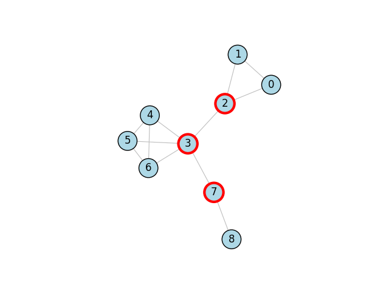

.. include:: ../../include/global.rst

.. _tutorials-articulation-points:

===================
Articulation Points
===================

.. _articulation_points: https://igraph.org/python/doc/api/igraph._igraph.GraphBase.html#articulation_points
.. |articulation_points| replace:: :meth:`articulation_points`

This example shows how to compute and visualize the `articulation points <https://en.wikipedia.org/wiki/Biconnected_component>`_ in a graph using |articulation_points|_. For an example on bridges instead, see :ref:`tutorials-bridges`.

.. code-block:: python

    import igraph as ig
    import matplotlib.pyplot as plt

    # Construct graph
    g = ig.Graph.Formula(
        "0-1-2-0, 3:4:5:6 - 3:4:5:6, 2-3-7-8",
    )

    # Find the set of articulation points as a vertex sequence
    articulation_points = g.vs[g.articulation_points()]

    # Plot graph
    fig, ax = plt.subplots()
    ig.plot(
        g, 
        target=ax, 
        vertex_size=0.3,
        vertex_color="lightblue",
        vertex_label=range(g.vcount()),
        vertex_frame_color = ["red" if v in articulation_points else "black" for v in g.vs],
        vertex_frame_width = [3 if v in articulation_points else 1 for v in g.vs],
        edge_width=0.8,
        edge_color='gray'
    )
    plt.show()

The plot looks like this:

    Articulation points are marked with a red border.
    
