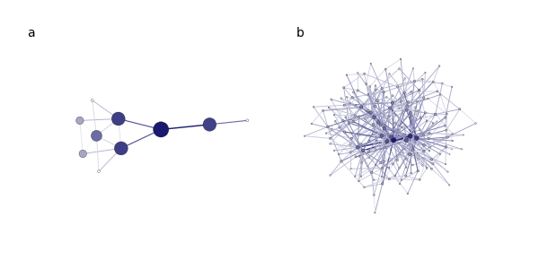

.. include:: ../../include/global.rst

.. _tutorials-betweenness:

=======================
Betweenness
=======================

.. _betweenness: https://igraph.org/python/doc/api/igraph._igraph.GraphBase.html#betweenness
.. |betweenness| replace:: :meth:`betweenness`
.. _edge_betweenness: https://igraph.org/python/doc/api/igraph._igraph.GraphBase.html#edge_betweenness
.. |edge_betweenness| replace:: :meth:`edge_betweenness`

This example demonstrates how to visualize both vertex and edge betweenness with a custom defined color palette. We use the methods |betweenness|_ and |edge_betweenness|_ respectively, and demonstrate the effects on a standard `Krackhardt Kite <https://www.wikiwand.com/en/Krackhardt_kite_graph>`_ graph, as well as a `Barabási-Albert <https://en.wikipedia.org/wiki/Barab%C3%A1si%E2%80%93Albert_model>`_ random graph.

.. code-block:: python

    import igraph as ig
    import matplotlib.pyplot as plt
    import math
    import random

    def plot_betweenness(g, ax):
        # Calculate vertex betweenness and scale it to be between 0.0 and 1.0
        vertex_betweenness = ig.rescale(g.betweenness(), clamp=True, 
                scale=lambda x : math.pow(x, 1/3))
        edge_betweenness = ig.rescale(g.edge_betweenness(), clamp=True, 
                scale=lambda x : math.pow(x, 1/2))

        ig.plot(
            g, 
            target=ax, 
            layout="fruchterman_reingold",
            palette=ig.GradientPalette("white", "midnightblue"),
            vertex_color=list(map(int, 
                    ig.rescale(vertex_betweenness, (0, 255), clamp=True))), 
            edge_color=list(map(int, 
                    ig.rescale(edge_betweenness, (0, 255), clamp=True))),
            vertex_size=ig.rescale(vertex_betweenness, (0.1, 0.6)), 
            edge_width=ig.rescale(edge_betweenness, (0.5, 1.0)), 
            vertex_frame_width=0.2,
        )

    # Generate Krackhardt Kite Graphs and Barabasi graphs
    random.seed(1)
    g1 = ig.Graph.Famous("Krackhardt_Kite")
    g2 = ig.Graph.Barabasi(n=200, m=2)

    # Plot the graph
    fig, axs = plt.subplots(1, 2, figsize=(6, 3))
    plot_betweenness(g1, axs[0])
    plot_betweenness(g2, axs[1])

    # Add "a" and "b" labels for panels
    fig.text(0.05, 0.9, 'a', va='top')
    fig.text(0.55, 0.9, 'b', va='top')

    plt.show()

.. _rescale: https://igraph.org/python/doc/api/igraph.utils.html#rescale
.. |rescale| replace:: :meth:`rescale`
    
Here we use |rescale|_ as a great way to linearly scale all data into ranges we can work with. Note that we scale the betweennesses for the vertices and edges by the cube root and square root respectively. The choice of scaling is arbitrary, but is used to give a smoother, more linear transition in the sizes and colors of nodes and edges. The final output graphs are as follows:

   Graph visualizing edge betweenness (a) in a Krackhardt Kite graph and (b) in a 200 node Barabási-Albert graph. Color legend: white to dark blue means low to high betweenness centrality.

