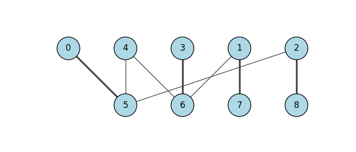

.. include:: ../../include/global.rst

.. _tutorials-bipartite-matching:

==========================
Maximum Bipartite Matching
==========================

.. _maximum_bipartite_matching: https://igraph.org/python/doc/api/igraph.Graph.html#maximum_bipartite_matching
.. |maximum_bipartite_matching| replace:: :meth:`maximum_bipartite_matching`

This example demonstrates an efficient way to find and visualise a maximum biparite matching using |maximum_bipartite_matching|_. First construct a bipartite graph

.. code-block:: python

    import igraph as ig
    import matplotlib.pyplot as plt

    # Assign nodes 0-4 to one side, and the nodes 5-8 to the other side
    g = ig.Graph.Bipartite(
        [0, 0, 0, 0, 0, 1, 1, 1, 1],
        [(0, 5), (1, 6), (1, 7), (2, 5), (2, 8), (3, 6), (4, 5), (4, 6)]
    )
    assert g.is_bipartite()

    matching = g.maximum_bipartite_matching()

Then run the maximum matching,

.. code-block:: python

    matching = g.maximum_bipartite_matching()

    # Print pairings for each node on one side
    matching_size = 0
    print("Matching is:")
    for i in range(5):
        print(f"{i} - {matching.match_of(i)}")
        if matching.is_matched(i):
            matching_size += 1
    print("Size of maximum matching is:", matching_size)

And finally display the bipartite graph with matchings highlighted.

.. code-block:: python

    fig, ax = plt.subplots(figsize=(7, 3))
    ig.plot(
        g,
        target=ax,
        layout=g.layout_bipartite(),
        vertex_size=0.4,
        vertex_label=range(g.vcount()),
        vertex_color="lightblue",
        edge_width=[3 if e.target == matching.match_of(e.source) else 1.0 for e in g.es],
        edge_color=["red" if e.target == matching.match_of(e.source) else "black" for e in g.es]
    )
    plt.show()

The received output is

.. code-block::

    Matching is:
    0 - 5
    1 - 7
    2 - 8
    3 - 6
    4 - None
    Size of maximum matching is: 4

   Maximum Bipartite Matching
