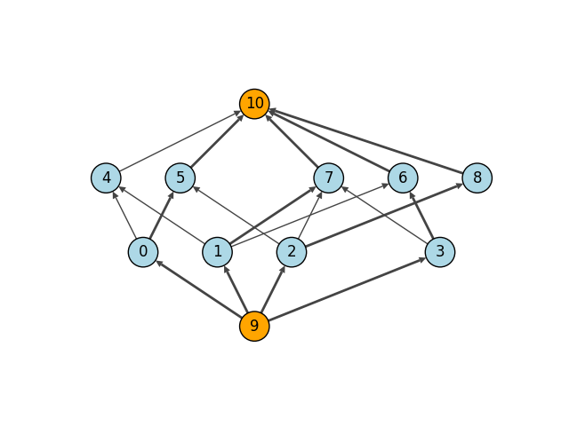

.. include:: include/global.rst

.. tutorials-bipartite-matching-maxflow

==========================================
Maximum Bipartite Matching by Maximum Flow
==========================================

This example presents how to visualise bipartite matching using maximum flow. Please note that the *igraph* already has :meth:`maximum_bipartite_matching` which is better suited for finding the maximum bipartite matching. For a demonstration on how to use that method instead, check out `Maximum Bipartite Matching<>`_. This particular example is purely for demonstrative purposes.

.. TODO: add link to Maximum Bipartite Matching

.. code-block:: python

    import igraph as ig
    import matplotlib.pyplot as plt

    # Generate the graph
    g = ig.Graph(
        9,
        [(0, 4), (0, 5), (1, 4), (1, 6), (1, 7), (2, 5), (2, 7), (2, 8), (3, 6), (3, 7)],
        directed=True
    )

    # Assign nodes 0-3 to one side, and the nodes 4-8 to the other side
    for i in range(4):
        g.vs[i]["type"] = True
    for i in range(4, 9):
        g.vs[i]["type"] = False

    g.add_vertices(2)
    g.add_edges([(9, 0), (9, 1), (9, 2), (9, 3)]) # connect source to one side
    g.add_edges([(4, 10), (5, 10), (6, 10), (7, 10), (8, 10)]) # ... and sinks to the other

    flow = g.maxflow(9, 10) # not setting capacities means that all edges have capacity 1.0
    print("Size of Maximum Matching (maxflow) is:", flow.value)

Let's compare the output against :meth:`maximum_bipartite_matching`

.. code-block:: python

    # Compare this to the "maximum_bipartite_matching()" function
    g2 = g.copy()
    g2.delete_vertices([9, 10]) # delete the source and sink, which are unneeded

    matching = g2.maximum_bipartite_matching()

    matching_size = 0
    for i in range(4):
        if matching.match_of(i):
            matching_size += 1
    print("Size of Maximum Matching (maximum_bipartite_matching) is:", matching_size)

And finally, display the original flow graph nicely with the matchings added

.. code-block:: python

    # Manually set the position of source and sink to display nicely
    layout = g.layout_bipartite()
    layout[9] = (2, -1)
    layout[10] = (2, 2)

    fig, ax = plt.subplots()
    ig.plot(
        g,
        target=ax,
        layout=layout,
        vertex_size=0.4,
        vertex_label=range(g.vcount()),
        vertex_color=["lightblue" if i < 9 else "orange" for i in range(11)],
        edge_width=[1.0 + flow.flow[i] for i in range(g.ecount())]
    )
    ax.set_aspect(1)
    plt.show()

The received output is:

.. code-block::

    Size of Maximum Matching (maxflow) is: 4.0
    Size of Maximum Matching (maximum_bipartite_matching) is: 4

   Maximal Bipartite Matching

Note that maximum flow will represent the capacities as real values, which is why our result is ``4.0`` instead of ``4``.
