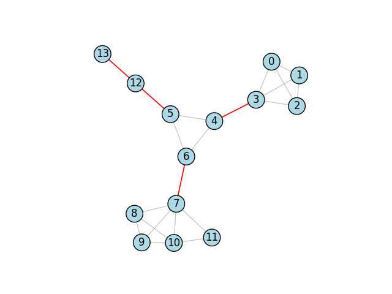
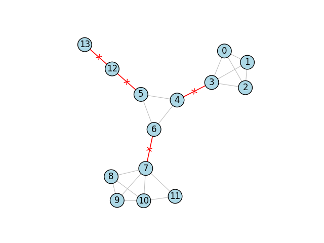

.. include:: ../../include/global.rst

.. _tutorials-bridges:

========
Bridges
========

.. _bridges_method: https://igraph.org/python/doc/api/igraph._igraph.GraphBase.html#bridges
.. |bridges_method| replace:: :meth:`bridges_method`

This example shows how to compute and visualize the `bridges <https://en.wikipedia.org/wiki/Bridge_(graph_theory)>`_ in a graph using |bridges_method|_. For an example on articulation points instead, see :ref:`tutorials-articulation-points`.

.. code-block:: python

    import igraph as ig
    import matplotlib.pyplot as plt

    # Construct graph
    g = ig.Graph(14, [(0, 1), (1, 2), (2, 3), (0, 3), (0, 2), (1, 3), (3, 4), 
            (4, 5), (5, 6), (6, 4), (6, 7), (7, 8), (7, 9), (9, 10), (10 ,11), 
            (11 ,7), (7, 10), (8, 9), (8, 10), (5, 12), (12, 13)])

    # Find and color bridges
    bridges = g.bridges()
    g.es["color"] = "gray"
    g.es[bridges]["color"] = "red"
    g.es["width"] = 0.8
    g.es[bridges]["width"] = 1.2

    # Plot graph
    fig, ax = plt.subplots()
    ig.plot(
        g, 
        target=ax, 
        vertex_size=0.3,
        vertex_color="lightblue",
        vertex_label=range(g.vcount())
    )
    plt.show()

The plot looks like this:

   Bridge edges are marked in red.

Advanced: Cutting Effect
--------------------------
Bridges are edges that when removed, will separate the graph into more components then they started with. To emphasise the removal of edges from the graph, we can add small "x" effect to each of the bridges by using edge labels. We add the following code to define the edge labels only for bridges:

.. code-block:: python
    
    g.es["label"] = ""
    g.es[bridges]["label"] = "x"

And then when we plot...

.. code-block:: python

    # Plot graph
    fig, ax = plt.subplots()
    ig.plot(
        g, 
        target=ax, 
        vertex_size=0.3,
        vertex_color="lightblue",
        vertex_label=range(g.vcount()),
        edge_background="#FFF0",    # transparent background color
        edge_align_label=True,      # make sure labels are aligned with the edge
        edge_label=g.es["label"],
        edge_label_color="red"
    )
    plt.show()

As a result, we get:

   Bridges marked with an additional "x" effect.

