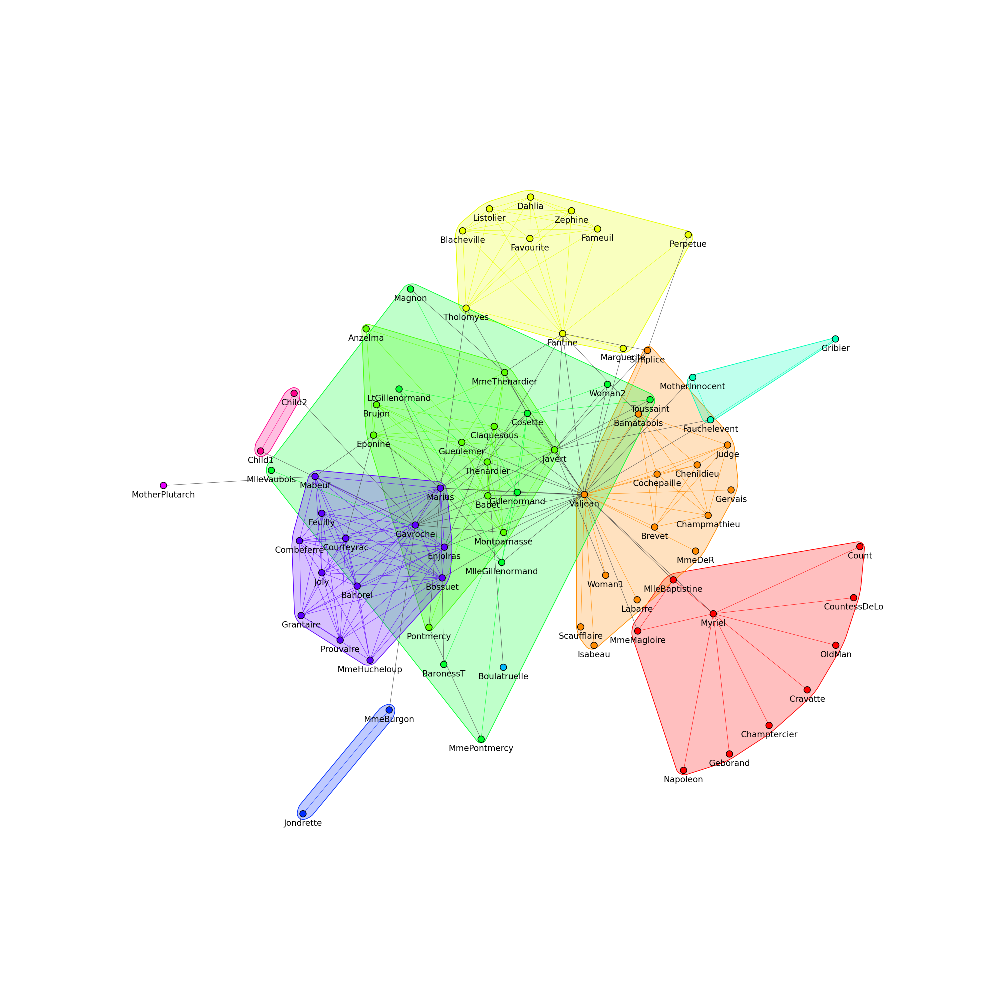
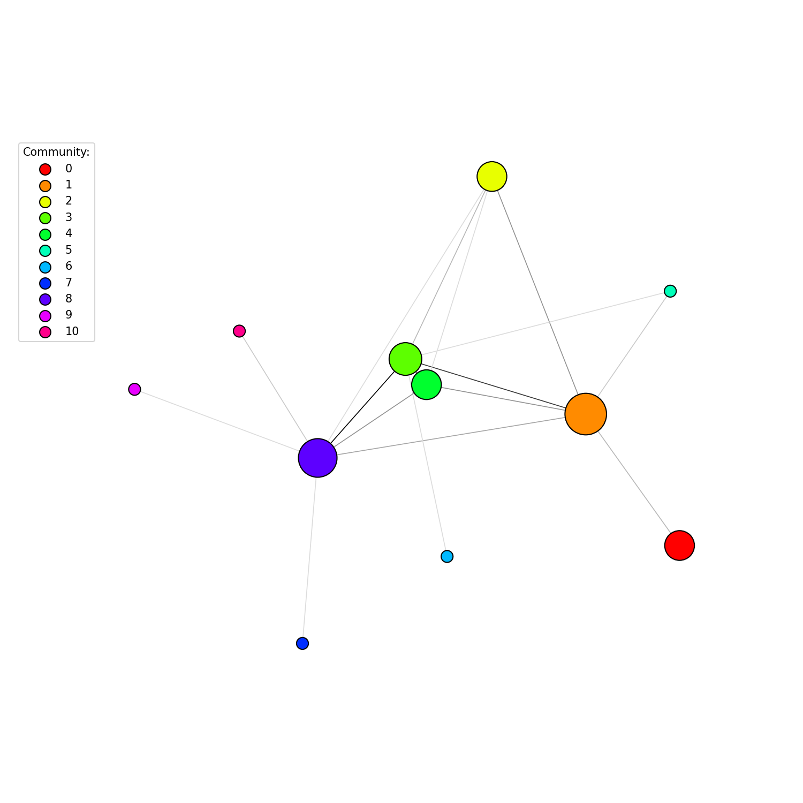

.. include:: ../../include/global.rst

.. _tutorials-cluster-graph:

===========================
Generating Cluster Graphs
===========================

.. _cluster_graph: https://igraph.org/python/doc/api/igraph.clustering.VertexClustering.html#cluster_graph
.. |cluster_graph| replace:: :meth:`cluster_graph`
.. _community_edge_betweenness: https://igraph.org/python/doc/api/igraph.Graph.html#community_edge_betweenness
.. |community_edge_betweenness| replace:: :meth:`community_edge_betweenness`

This example shows how to find the communities in a graph, then contract each community into a single node using |cluster_graph|_. For this tutorial, we'll use the *Donald Knuth's Les Miserables Network*, which shows the coapperances of characters in the novel *Les Miserables*. The network can be obtained `here <http://www-personal.umich.edu/~mejn/netdata/>`_. 

.. code-block:: python
    
    import igraph as ig
    import matplotlib.pyplot as plt

    # Load the graph
    g = ig.load("./lesmis/lesmis.gml")

First, let's visualise the original communities, using |community_edge_betweenness|_ to separate out vertices into clusters. (For a more focused tutorial on just visualising communities, check out :ref:`tutorials-visualize-communities`).

.. code-block:: python

    # Generate communities
    communities = g.community_edge_betweenness()
    communities = communities.as_clustering() # Convert into a VertexClustering for plotting

    # Print them out
    for i, community in enumerate(communities):
        print(f"Community {i}:")
        for v in community:
            print(f"\t{g.vs[v]['label']}")

    # Set community colors
    num_communities = len(communities)
    palette1 = ig.RainbowPalette(n=num_communities)
    for i, community in enumerate(communities):
        g.vs[community]["color"] = i
        community_edges = g.es.select(_within=community)
        community_edges["color"] = i

    g.vs["label"] = ["\n\n" + label for label in g.vs["label"]] # Move the labels below the vertices

    # Plot the communities
    fig1, ax1 = plt.subplots()
    ig.plot(
        communities, 
        target=ax1,
        mark_groups=True,
        palette=palette1,
        vertex_size=0.1,
        edge_width=0.5,
    )
    fig1.set_size_inches(20, 20)
    fig1.savefig("../figures/communities.png", dpi=200)

Now let's try and contract the information down, using only a single vertex to represent each community. We start by defining attribute values for each of the nodes in the original graph.

.. code-block:: python
    
    # Assign x, y, and sizes for each node
    layout = g.layout_kamada_kawai()
    g.vs["x"], g.vs["y"] = list(zip(*layout))
    g.vs["size"] = 1
    g.es["size"] = 1

This is so we can define how each of these attributes get combined together when we call |cluster_graph|_.

.. code-block:: python
    
    # Generate cluster graph
    cluster_graph = communities.cluster_graph(
        combine_vertices={
            "x": "mean", 
            "y": "mean",
            "color": "first",
            "size": "sum",
        },
        combine_edges={
            "size": "sum",
        },
    )

Here, we take the mean of x and y values so that the nodes in the cluster graph are placed at the center of the original cluster's position.

.. _contract_vertices: https://igraph.org/python/doc/api/igraph._igraph.GraphBase.html#contract_vertices
.. |contract_vertices| replace:: :meth:`contract_vertices`

.. note::

    ``mean``, ``first``, and ``sum`` are all built-in collapsing functions, along with ``prod``, ``median``, ``max``, ``min``, ``last``, ``random``. You can also define your own custom collapsing functions, which take in a list and return a single element representing the combined attribute value. For more details on |igraph| contraction, see |contract_vertices|_

Finally we plot out the graph using our calculated attributes:

.. code-block:: python

    # Plot the cluster graph
    palette2 = ig.GradientPalette("gainsboro", "black")
    g.es["color"] = [palette2.get(int(i)) for i in ig.rescale(cluster_graph.es["size"], (0, 255), clamp=True)]

    fig2, ax2 = plt.subplots()
    ig.plot(
        cluster_graph, 
        target=ax2,
        palette=palette1,
        # set a minimum size on vertex_size, otherwise vertices are too small
        vertex_size=[max(0.2, size / 20) for size in cluster_graph.vs["size"]], 
        edge_color=g.es["color"],
        edge_width=0.8,
    )

    # Add a legend
    legend_handles = []
    for i in range(num_communities):
        handle = ax2.scatter(
            [], [],
            s=100,
            facecolor=palette1.get(i),
            edgecolor="k",
            label=i,
        )
        legend_handles.append(handle)

    ax2.legend(
        handles=legend_handles,
        title='Community:',
        bbox_to_anchor=(0, 1.0),
        bbox_transform=ax2.transAxes,
    )

    fig2.set_size_inches(10, 10)
    fig2.savefig("../figures/cluster_graph.png", dpi=150)

The two figures are shown side by side here:

|pic1| |pic2|

... and the final output of the communities we printed out are displayed below:

.. code-block::

    Community 0:
        Myriel
        Napoleon
        MlleBaptistine
        MmeMagloire
        CountessDeLo
        Geborand
        Champtercier
        Cravatte
        Count
        OldMan
    Community 1:
        Labarre
        Valjean
        MmeDeR
        Isabeau
        Gervais
        Bamatabois
        Simplice
        Scaufflaire
        Woman1
        Judge
        Champmathieu
        Brevet
        Chenildieu
        Cochepaille
    Community 2:
        Marguerite
        Tholomyes
        Listolier
        Fameuil
        Blacheville
        Favourite
        Dahlia
        Zephine
        Fantine
        Perpetue
    Community 3:
        MmeThenardier
        Thenardier
        Javert
        Pontmercy
        Eponine
        Anzelma
        Gueulemer
        Babet
        Claquesous
        Montparnasse
        Brujon
    Community 4:
        Cosette
        Woman2
        Gillenormand
        Magnon
        MlleGillenormand
        MmePontmercy
        MlleVaubois
        LtGillenormand
        BaronessT
        Toussaint
    Community 5:
        Fauchelevent
        MotherInnocent
        Gribier
    Community 6:
        Boulatruelle
    Community 7:
        Jondrette
        MmeBurgon
    Community 8:
        Gavroche
        Marius
        Mabeuf
        Enjolras
        Combeferre
        Prouvaire
        Feuilly
        Courfeyrac
        Bahorel
        Bossuet
        Joly
        Grantaire
        MmeHucheloup
    Community 9:
        MotherPlutarch
    Community 10:
        Child1
        Child2

