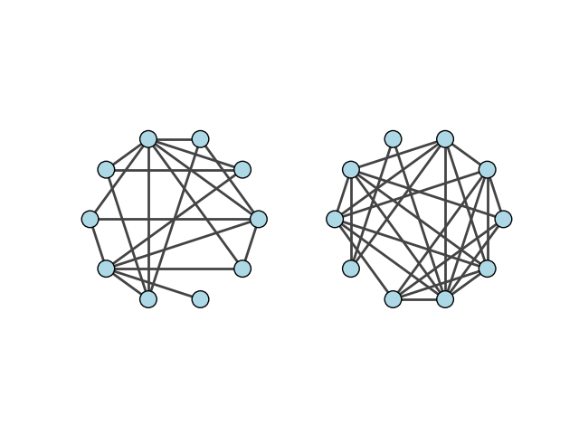

.. include:: ../../include/global.rst

.. _tutorials-complement:

================
Complement
================

.. _complementer: https://igraph.org/python/doc/api/igraph._igraph.GraphBase.html#complementer
.. |complementer| replace:: :meth:`complementer`

This example shows how to generate the `complement graph <https://en.wikipedia.org/wiki/Complement_graph>`_ of a graph (sometimes known as the anti-graph) using |complementer|_.

First we generate a random graph

.. code-block:: python

    import igraph as ig
    import matplotlib.pyplot as plt
    import random

    # Create a random graph
    random.seed(0)
    g1 = ig.Graph.Erdos_Renyi(n=10, p=0.5)

To compute the complement graph:

.. code-block:: python

    # Generate complement
    g2 = g1.complementer(loops=False)

Of course, the union of the original graph and its complement creates the full graph:

.. code-block:: python

    g_full = g1 | g2

And the complement is a graph with the same number of vertices and no edges:

.. code-block:: python

    g_empty = g_full.complementer(loops=False)

To appreciate these results, we can easily plot the four graphs:

.. code-block:: python

    fig, axs = plt.subplots(2, 2)
    ig.plot(
        g1,
        target=axs[0, 0],
        layout="circle",
        vertex_color="black",
    )
    axs[0, 0].set_title('Original graph')
    ig.plot(
        g2,
        target=axs[0, 1],
        layout="circle",
        vertex_color="black",
    )
    axs[0, 1].set_title('Complement graph')
    
    ig.plot(
        g_full,
        target=axs[1, 0],
        layout="circle",
        vertex_color="black",
    )
    axs[1, 0].set_title('Union graph')
    ig.plot(
        g_empty,
        target=axs[1, 1],
        layout="circle",
        vertex_color="black",
    )
    axs[1, 1].set_title('Complement of union graph')
    plt.show()

   The original graph (top left), its complement (top right),
   their union (bottom left) and its complement (bottom right).
