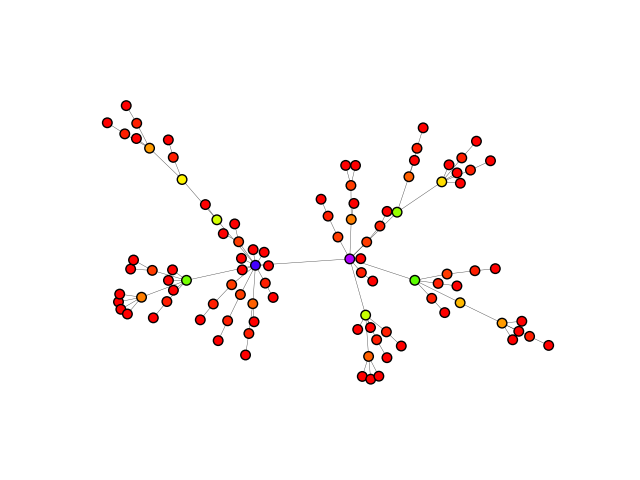

.. include:: ../../include/global.rst

.. _tutorials-configuration:

======================
Configuration Instance
======================

This example shows how to use |igraph|'s `configuration instance <https://igraph.org/python/doc/api/igraph.configuration.Configuration.html>`_ to set default |igraph| settings. This is useful for setting global settings so that they don't need to be explicitly stated at the beginning of every |igraph| project you work on.

First we define the default plotting backend, layout, and color palette, and save them. By default, ``ig.config.save()`` will save files to ``~/.igraphrc`` on Linux and Max OS X systems, or in ``C:\Documents and Settings\username\.igraphrc`` for Windows systems.

.. code-block:: python

    import igraph as ig

    # Set configuration variables
    ig.config["plotting.backend"] = "matplotlib"
    ig.config["plotting.layout"] = "fruchterman_reingold"
    ig.config["plotting.palette"] = "rainbow"

    # Save configuration to ~/.igraphrc
    ig.config.save()

This script only needs to be run once (to store the new config options into the ``.igraphrc`` file). Whenever you use |igraph| and this file exists, |igraph| will read its content and use those options as defaults. For example:

.. code-block:: python

    import igraph as ig
    import matplotlib.pyplot as plt
    import random

    # Generate a graph
    random.seed(1)
    g = ig.Graph.Barabasi(n=100, m=1)

    # Calculate a color value between 0-200 for all nodes
    betweenness = g.betweenness()
    colors = [int(i * 200 / max(betweenness)) for i in betweenness]

    # Plot the graph
    ig.plot(g, vertex_color=colors, vertex_size=1, edge_width=0.3)
    plt.show()

Note that we do not never explicitly state the backend, layout or palette, yet the final plots look like this:

   Graph colored based on each node's betweenness centrality measure.

The full list of config settings can be found `here <https://igraph.org/python/doc/api/igraph.configuration.Configuration.html>`_. 

.. note::
    
   You can have multiple config files: specify each location via ``ig.config.save("./path/to/config/file")``. To load a specific config, import igraph and then call ``ig.config.load("./path/to/config/file")``

.. note::

    To use a consistent style between individual plots (e.g. vertex sizes, colors, layout etc.) check out :ref:`tutorials-visual-style`. 
