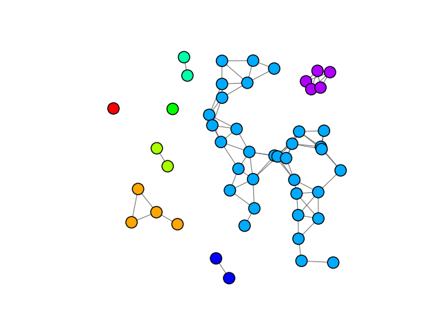

.. include:: ../../include/global.rst

.. _tutorials-connected-components:

=====================
Connected Components
=====================

.. _connected_components: https://igraph.org/python/doc/api/igraph.Graph.html#connected_components
.. |connected_components| replace:: :meth:`connected_components`

This example demonstrates how to visualise the connected components in a graph using |connected_components|_.

.. code-block:: python

    import igraph as ig
    import matplotlib.pyplot as plt
    import random

    # Generate a random geometric graph with random vertex sizes 
    random.seed(0)
    g = ig.Graph.GRG(50, 0.15)

    # Cluster graph into weakly connected components
    components = g.connected_components(mode='weak')

    # Visualise different components
    fig, ax = plt.subplots()
    ig.plot(
        components,
        target=ax,
        palette=ig.RainbowPalette(),
        vertex_size=0.05,
        vertex_color=list(map(int, ig.rescale(components.membership, (0, 200), clamp=True))),
        edge_width=0.7
    )

    plt.show()

The plotting results are:

   A graph separated into its weakly connected components.

.. note::

    We use the integers from 0 to 200 instead of 0 to 255 in our vertex colors, since 255 in the `rainbow palette <https://igraph.org/python/doc/api/igraph.drawing.colors.RainbowPalette.html>`_ corresponds to looping back to red.
