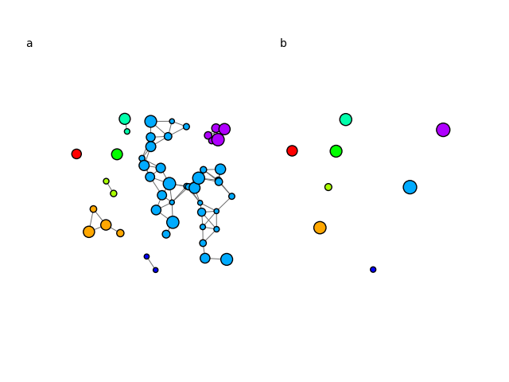

.. include:: ../../include/global.rst

.. _tutorials-contracting-clusters:

=====================
Contracting Clusters
=====================

This example demonstrates how to contract a clustered graph down so that each cluster is represented by a single vertex. First we construct a clustering and plot it:

.. code-block:: python

    import igraph as ig
    import matplotlib.pyplot as plt
    import random

    # Generate a random geometric graph with random vertex sizes 
    random.seed(0)
    g1 = ig.Graph.GRG(50, 0.15)
    g1.vs['vertex_size'] = [random.uniform(0.03, 0.08) for i in range(g1.vcount())]

    # Cluster graph into weakly connected components
    clusters = g1.clusters(mode='weak')
    nclusters = len(clusters)

    # Visualise different components
    fig, axs = plt.subplots(1, 2)
    ig.plot(
        clusters,
        target=axs[0],
        palette=ig.RainbowPalette(),
        vertex_size=g1.vs['vertex_size'],
        vertex_color=list(map(int, ig.rescale(clusters.membership, (0, 200), clamp=True))),
        edge_width=0.7
    )

.. _contract_vertices: https://igraph.org/python/doc/api/igraph._igraph.GraphBase.html#contract_vertices
.. |contract_vertices| replace:: :meth:`contract_vertices`

Next we generate the contracted cluster graph. We also define how we should treat each of the vertex attributes when combining them. We use the average position of the cluster as the position of the new vertex, and set the vertex size to be the maximum size of all the vertices in it's cluster. See |contract_vertices|_ for more details on allowed combining functions. 

.. code-block:: python

    # Contract vertices, using mean value for coordinates, and using the max vertex_size as the representation
    def mean(list):
        return sum(list) / len(list)

    g2 = clusters.cluster_graph(combine_vertices={'x':mean, 'y':mean, 'vertex_size':max})

.. _rescale: https://igraph.org/python/doc/api/igraph.utils.html#rescale
.. |rescale| replace:: :meth:`rescale`

Finally, we plot out the new graph. We use |rescale|_ to assign each cluster a value between 0 and 200, which we use to assign a color from the `rainbow palette <https://igraph.org/python/doc/api/igraph.drawing.colors.RainbowPalette.html>`_.

.. code-block:: python

    # Visualise the clustered graph
    ig.plot(
        g2,
        target=axs[1],
        palette=ig.RainbowPalette(),
        vertex_size=g2.vs['vertex_size'],
        vertex_color=list(map(int, ig.rescale(range(nclusters), (0, 200), clamp=True))),
    )
    
    # Add "a" and "b" labels for panels
    fig.text(0.05, 0.9, 'a', va='top')
    fig.text(0.55, 0.9, 'b', va='top')
    
    plt.show()

    

The plotting results can be seen as follows:

   A graph (a) separated into clusters and (b) contracted down to its cluster graph.

