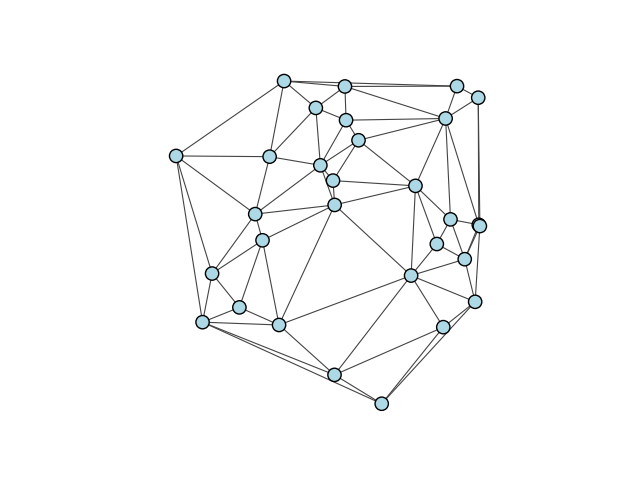
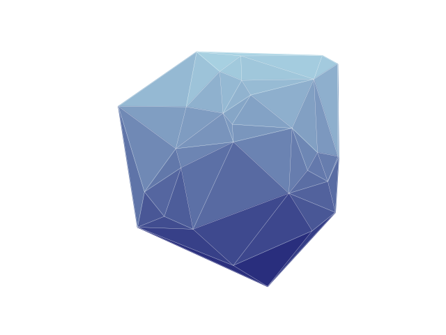

.. include:: ../../include/global.rst

.. _tutorials-delaunay-triangulation:

======================
Delaunay Triangulation
======================

This example demonstrates how to calculate the `Delaunay triangulation <https://en.wikipedia.org/wiki/Delaunay_triangulation>`_ of an input graph. We start by generating a set of points on a 2D grid using random ``numpy`` arrays and a graph with those vertex coordinates and no edges.

.. code-block:: python

    import numpy as np
    from scipy.spatial import Delaunay
    import igraph as ig
    import matplotlib.pyplot as plt

    # Generate a random graph in the 2D unit cube
    np.random.seed(0)  # To ensure reproducibility
    x, y = np.random.rand(2, 30)
    g = ig.Graph(30)
    g.vs['x'] = x
    g.vs['y'] = y

We then use `SciPy's Delaunay function <https://docs.scipy.org/doc/scipy/reference/generated/scipy.spatial.Delaunay.html>`_ to generate the triangles, and then loop through them to add them back into our original graph. We make sure to simplify the graph afterwards to remove multiple edges caused by triangles sharing a side.

.. code-block:: python

    # Calculate the delaunay triangulation, and add the edges into the original graph
    coords = g.layout_auto().coords
    delaunay = Delaunay(coords)
    for tri in delaunay.simplices:
        g.add_edges([
            (tri[0], tri[1]), 
            (tri[1], tri[2]), 
            (tri[0], tri[2]),
        ])
    g.simplify()

Finally, we display the graph:

.. code-block:: python

    # Plot the graph
    fig, ax = plt.subplots()
    ig.plot(
        g,
        target=ax,
        vertex_size=0.04,
        vertex_color="lightblue",
        edge_width=0.8
    )
    plt.show()

Our output looks like this:

   The Delaunay triangulation

Advanced: Improving plotting style
----------------------------------
Sometimes, we would like to emphasise the actual triangles generated by the Delaunay triangulation. We'll add in some triangles and color them according to their y coordinate.

.. code-block:: python

    # Plot the triangles
    fig, ax = plt.subplots()

    palette = ig.GradientPalette("midnightblue", "lightblue", 100)
    for tri in delaunay.simplices:
        # get the points of the triangle
        tri_points = [delaunay.points[tri[i]] for i in range(3)]

        # calculate the vertical center of the triangle
        center = (tri_points[0][1] + tri_points[1][1] + tri_points[2][1]) / 3 

        # draw triangle onto axes
        poly = plt.Polygon(tri_points, color=palette.get(int(center*100)))
        ax.add_patch(poly)

We then plot the original graph edges on top:

.. code-block:: python

    # Plot the graph on top
    ig.plot(
        g,
        target=ax,
        vertex_size=0.0,
        edge_width=0.2,
        edge_color="white",
    )
    plt.show()

The final output looks like this:

   The Delaunay triangulation, with colored triangles.
