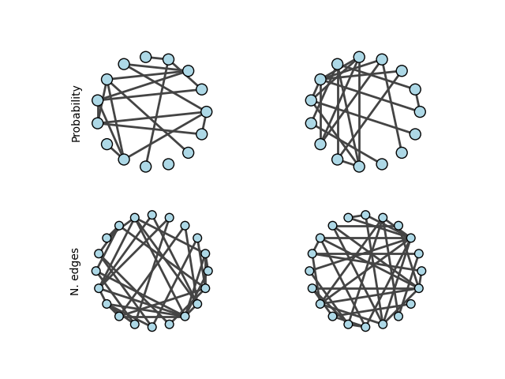

.. include:: ../../include/global.rst

.. _tutorials-random:

=================
Erdős-Rényi Graph
=================

.. _Erdos_Renyi: https://igraph.org/python/doc/api/igraph._igraph.GraphBase.html#Erdos_Renyi
.. |Erdos_Renyi| replace:: :meth:`Erdos_Renyi`

This example demonstrates how to generate `Erdős-Rényi Graphs <https://en.wikipedia.org/wiki/Erd%C5%91s%E2%80%93R%C3%A9nyi_model>`_ using |Erdos_Renyi|_. There are two variants of graphs:

- ``Erdos_Renyi(n, p)`` will generate a graph where each edge between any two pair of nodes has an independent probability ``p`` of existing.
- ``Erdos_Renyi(n, m)`` will pick a graph uniformly at random out of all graphs with ``n`` nodes and ``m`` edges.

We generate two graphs of each, so we can confirm that our graph generator is truly random.

.. code-block:: python

    import igraph as ig
    import matplotlib.pyplot as plt
    import random

    # Set a random seed for reproducibility
    random.seed(0)

    # Generate two Erdos Renyi graphs based on probability
    g1 = ig.Graph.Erdos_Renyi(n=15, p=0.2, directed=False, loops=False)
    g2 = ig.Graph.Erdos_Renyi(n=15, p=0.2, directed=False, loops=False)

    # Generate two Erdos Renyi graphs based on number of edges
    g3 = ig.Graph.Erdos_Renyi(n=20, m=35, directed=False, loops=False)
    g4 = ig.Graph.Erdos_Renyi(n=20, m=35, directed=False, loops=False)

    # Print out summaries of each graph
    ig.summary(g1)
    ig.summary(g2)
    ig.summary(g3)
    ig.summary(g4)

    fig, axs = plt.subplots(2, 2)
    # Probability
    ig.plot(
        g1,
        target=axs[0, 0],
        layout="circle",
        vertex_color="lightblue"
    )
    ig.plot(
        g2,
        target=axs[0, 1],
        layout="circle",
        vertex_color="lightblue"
    )
    axs[0, 0].set_ylabel('Probability')
    # N edges
    ig.plot(
        g3,
        target=axs[1, 0],
        layout="circle",
        vertex_color="lightblue",
        vertex_size=0.15
    )
    ig.plot(
        g4,
        target=axs[1, 1],
        layout="circle",
        vertex_color="lightblue",
        vertex_size=0.15
    )
    axs[1, 0].set_ylabel('N. edges')
    plt.show()

The received output is:

.. code-block::

    IGRAPH U--- 15 18 --
    IGRAPH U--- 15 21 --
    IGRAPH U--- 20 35 --
    IGRAPH U--- 20 35 --

    Erdős-Rényi random graphs With probability ``p`` = 0.2 (top) and with number of edges ``m`` = 35 (bottom).

.. note::
    
    Even when using the same random seed, results can still differ depending on the machine the code is being run from.
