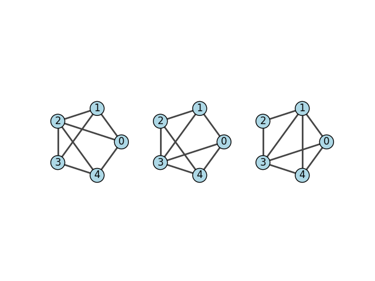

.. include:: ../../include/global.rst

.. _tutorials-isomorphism:

===========
Isomorphism
===========

.. _isomorphic: https://igraph.org/python/doc/api/igraph._igraph.GraphBase.html#isomorphic
.. |isomorphic| replace:: :meth:`isomorphic`

This example shows how to check for `isomorphism <https://en.wikipedia.org/wiki/Graph_isomorphism>`_ between small graphs using |isomorphic|_.

First we generate three different graphs:

.. code-block:: python

    import igraph as ig
    import matplotlib.pyplot as plt

    # Create Graphs
    g1 = ig.Graph([(0, 1), (0, 2), (0, 4), (1, 2), (1, 3), (2, 3), (2, 4), (3, 4)])
    g2 = ig.Graph([(4, 2), (4, 3), (4, 0), (2, 3), (2, 1), (3, 1), (3, 0), (1, 0)])
    g3 = ig.Graph([(4, 1), (4, 3), (4, 0), (2, 3), (2, 1), (3, 1), (3, 0), (1, 0)])

To check if they are isomorphic, we run:

.. code-block:: python

    # Check isomorphism
    print("Are the graphs g1 and g2 isomorphic?")
    print(g1.isomorphic(g2))
    print("Are the graphs g1 and g3 isomorphic?")
    print(g1.isomorphic(g3))
    print("Are the graphs g2 and g3 isomorphic?")
    print(g2.isomorphic(g3))

The final output is:

.. code-block::

    Are the graphs g1 and g2 isomorphic?
    True
    Are the graphs g1 and g3 isomorphic?
    False
    Are the graphs g2 and g3 isomorphic?
    False

.. note::
   `Graph isomorphism <https://en.wikipedia.org/wiki/Graph_isomorphism>`_ is an equivalence
   relationship, i.e. if `g1 ~ g2` and `g2 ~ g3`, then automatically `g1 ~ g3`. Therefore,
   we could have skipped the last check in our example.

We can plot the graphs to get an idea about the problem:

.. code-block:: python

    # Plot graphs
    visual_style = {
        "vertex_color": "lightblue",
        "vertex_label": [0, 1, 2, 3, 4],
        "vertex_size": 0.4,
    }

    fig, axs = plt.subplots(1, 3)
    ig.plot(
        g1,
        layout=g1.layout("circle"),
        target=axs[0],
        **visual_style,
    )
    ig.plot(
        g2,
        layout=g1.layout("circle"),
        target=axs[1],
        **visual_style,
    )
    ig.plot(
        g3,
        layout=g1.layout("circle"),
        target=axs[2],
        **visual_style,
    )
    fig.text(0.38, 0.5, '$\simeq$' if g1.isomorphic(g2) else '$\\neq$', fontsize=15, ha='center', va='center')
    fig.text(0.65, 0.5, '$\simeq$' if g2.isomorphic(g3) else '$\\neq$', fontsize=15, ha='center', va='center')
    plt.show()

   Three graphs to be compared for isomorphism
