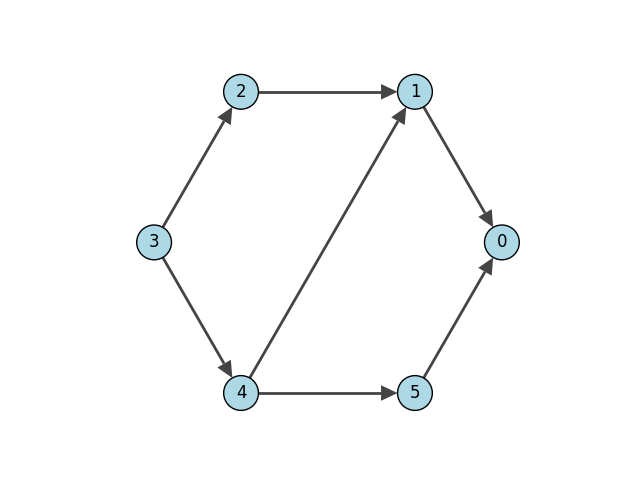

.. include:: include/global.rst

.. tutorials-maxflow

============
Maximum Flow
============

This example shows how to construct a max flow on a directed graph with edge capacities.

.. code-block:: python

    import igraph as ig
    import matplotlib.pyplot as plt

    # Generate the graph with its capacities
    g = ig.Graph(
        6,
        [(3, 2), (3, 4), (2, 1), (4,1), (4, 5), (1, 0), (5, 0)],
        directed=True
    )
    g.es["capacity"] = [7, 8, 1, 2, 3, 4, 5] # capacity of each edge

    # Run the max flow
    flow = g.maxflow(3, 0, capacity=g.es["capacity"])

    print("Max flow:", flow.value)
    print("Edge assignments:", flow.flow)

The received output is:

.. code-block::

    Max flow: 6.0
    Edge assignments [1.0, 5.0, 1.0, 2.0, 3.0, 3.0, 3.0]

   The flow graph
