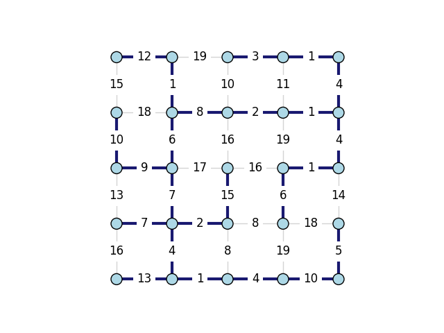

.. include:: ../../include/global.rst

.. _tutorials-minimum-spanning-trees:

======================
Minimum Spanning Trees
======================

.. _spanning_tree: https://igraph.org/python/doc/api/igraph.Graph.html#spanning_tree
.. |spanning_tree| replace:: :meth:`spanning_tree`

This example shows how to generate a `minimum spanning tree <https://en.wikipedia.org/wiki/Minimum_spanning_tree>`_ from an input graph using |spanning_tree|_. If you only need a regular spanning tree, check out :ref:`tutorials-spanning-trees`.

We start by generating a grid graph with random integer weights between 1 and 20:

.. code-block:: python
    
    import random
    import igraph as ig
    import matplotlib.pyplot as plt

    # Generate grid graph with random weights
    random.seed(0)

    g = ig.Graph.Lattice([5, 5], circular=False)
    g.es["weight"] = [random.randint(1, 20) for _ in g.es]

We then call |spanning_tree|_, making sure to pass in the randomly generated weights.

.. code-block:: python

    # Generate spanning tree
    spanning_tree = g.spanning_tree(weights=None, return_tree=False)

Finally, we generate the plot the graph and visualise the spanning tree. We also print out the sum of the edges in the MST.

.. code-block:: python
    
    # Plot graph
    g.es["color"] = "lightgray"
    g.es[spanning_tree]["color"] = "midnightblue"
    g.es["width"] = 0.5
    g.es[spanning_tree]["width"] = 3.0

    fig, ax = plt.subplots()
    ig.plot(
        g,
        target=ax,
        layout=layout,
        vertex_color="lightblue",
        edge_width=g.es["width"]
    )
    plt.show()

    # Print out minimum edge weight sum
    print("Minimum edge weight sum:", sum(g.es[mst_edges]["weight"]))

The final plot looks like this:

   Minimum spanning tree edges are bolded.

... and the output looks like this:

.. code-block:: 

    Minimum edge weight sum: 136

.. note::
    
    The randomised weights may vary depending on the machine that you run this code on.
