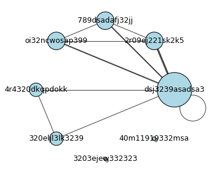
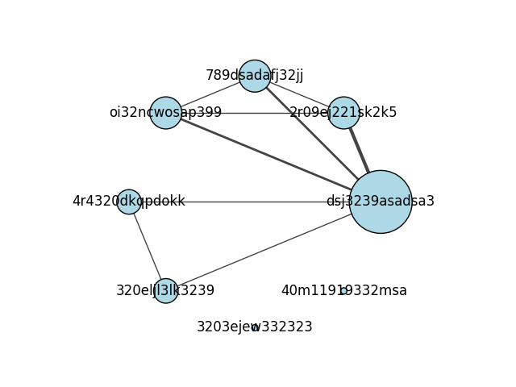

.. include:: ../../include/global.rst

.. _tutorials-online-user-actions:

===================
Online user actions
===================

This example reproduces a typical data science situation in an internet company. We start from a pandas DataFrame with online user actions, for instance for an online text editor: the user can create a page, edit it, or delete it. We want to construct and visualize a graph of the users highlighting collaborations on the same page/project.

.. code-block:: python

    import igraph as ig
    import numpy as np
    import pandas as pd
    import matplotlib.pyplot as plt

    # User data (usually would come with time stamp)
    action_dataframe = pd.DataFrame([
        ['dsj3239asadsa3', 'createPage', 'greatProject'],
        ['2r09ej221sk2k5', 'editPage', 'greatProject'],
        ['dsj3239asadsa3', 'editPage', 'greatProject'],
        ['789dsadafj32jj', 'editPage', 'greatProject'],
        ['oi32ncwosap399', 'editPage', 'greatProject'],
        ['4r4320dkqpdokk', 'createPage', 'miniProject'],
        ['320eljl3lk3239', 'editPage', 'miniProject'],
        ['dsj3239asadsa3', 'editPage', 'miniProject'],
        ['3203ejew332323', 'createPage', 'private'],
        ['3203ejew332323', 'editPage', 'private'],
        ['40m11919332msa', 'createPage', 'private2'],
        ['40m11919332msa', 'editPage', 'private2'],
        ['dsj3239asadsa3', 'createPage', 'anotherGreatProject'],
        ['2r09ej221sk2k5', 'editPage', 'anotherGreatProject'],
        ],
        columns=['userid', 'action', 'project'],
    )

This block just introduces the toy data: a DataFrame with three columns, namely the user id, the action, and the page or project that was being actioned upon. Now we need to check when two users worked on the same page. We choose to use a weighted adjacency matrix for this, i.e. a table with rows and columns indexes by the users that has nonzero entries whenever folks collaborate. First, let's get the users and prepare an empty matrix:

.. code-block:: python

    users = action_dataframe['userid'].unique()
    adjacency_matrix = pd.DataFrame(
        np.zeros((len(users), len(users)), np.int32),
        index=users,
        columns=users,
    )

Then, let's iterate over all projects one by one, and add all collaborations:

.. code-block:: python

   for project, project_data in action_dataframe.groupby('project'):
       project_users = project_data['userid'].values
       for i1, user1 in enumerate(project_users):
           for user2 in project_users[:i1]:
               adjacency_matrix.at[user1, user2] += 1

There are many ways to achieve the above matrix, so don't be surprised if you came up with another algorithm ;-)

Now it's time to make the graph:

.. code-block:: python

    g = ig.Graph.Weighted_Adjacency(adjacency_matrix, mode='plus')

And finally, let's plot a layout of the graph, for instance a circle:

.. code-block:: python

    # Make a layout first
    layout = g.layout('circle')
    
    # Make vertex size based on their closeness to other vertices
    vertex_size = g.closeness()
    vertex_size = [0.5 * v**2 if not np.isnan(v) else 0.05 for v in vertex_size]
    
    # Make mpl axes
    fig, ax = plt.subplots()
    
    # Plot graph in that axes
    ig.plot(
        g,
        target=ax,
        layout=layout,
        vertex_label=g.vs['name'],
        vertex_color="lightblue",
        vertex_size=vertex_size,
        edge_width=g.es["weight"],
    )
    plt.show()

We added a few fancy features to this plot to show off igraph's capabilities. The result is shown below.

   The collaboration graph: thicker edges mean multiple collaborations, and larger vertices indicate users with higher closeness to the rest of the network.

Loops indicate "self-collaborations", which are not very meaningful. To filter out loops without losing the edge weights, we can use:

.. code-block:: python

    g = g.simplify(combine_edges='first')

and then repeat the plotting code verbatim. The result is shown below.

   Simplified graph after loops are filtered out.
