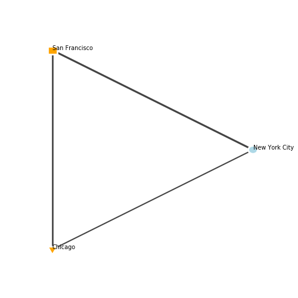

===========
Quick Start
===========
This is a short condensed segment aimed at those who want a very quick and dirty rundown on the basics of *igraph*. For a more in depth explanation about what each part of this code is doing, check out `tutorial link.<>`_

.. code-block:: python

    import igraph as ig
    import matplotlib.pyplot as plt

    # Construct a graph with 3 vertices
    n_vertices = 3
    edges = [(0, 1), (1, 2), (2, 0)]
    g = ig.Graph(n_vertices, edges)

    # Set attributes for the graph, nodes, and edges
    g["title"] = "Cities of America"
    g.vs["name"] = ["New York City", "San Francisco", "Los Angeles"]
    g.vs["population"] = [8.62e+6, 8.74e+5, 4.08e+6]
    g.es["distance"] = [4160, 559, 3980]

    # Set individual attributes
    g.vs[2]["name"] = "Chicago"
    g.vs[2]["population"] = 2.71e+6
    g.es[1]["distance"] = 2960
    g.es[2]["distance"] = 1180

    # Plot in matplotlib
    fig, ax = plt.subplots(figsize=(5,5))
    ig.plot(
        g,
        target=ax,
        layout=g.layout("circle"), # print nodes in a circular layout
        vertex_size=0.07, # set vertex_size of all vertices at once
        vertex_color=["lightblue", "orange", "orange"], # set colours individually
        vertex_frame_color=["white", "white", "white"],
        vertex_frame_width=2.0,
        vertex_shape=["circle", "rectangle", "triangle-down"],
        vertex_label=g.vs["name"],
        vertex_label_size=7.0,
        edge_width=[1.2+dist/4000.0 for dist in g.es["distance"]], # longer distances = thicker edges
    )

    plt.show()

    # Save the graph as an image file
    fig.savefig('america.png')
    fig.savefig('america.jpg')
    fig.savefig('america.pdf')

    # Export and import a graph as a GML file.
    g.save("america.gml")
    g = ig.load("america.gml")

... and here is the graph generated by the code:

