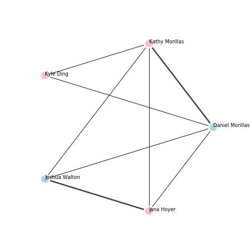

.. include:: include/global.rst

.. tutorials-quickstart

===========
Quick Start
===========

This quick start will demonstrate the following:

- Construct a *igraph* graph from scratch
- Set the attributes of nodes and edges
- Plot out a graph using matplotlib
- Save a graph as an image
- Export and import a graph as a ``.gml`` file

This example is aimed at those with some familiarity with python and/or graphing packages, who would like to get some code up and running as fast as possible.

.. code-block:: python

    import igraph as ig
    import matplotlib.pyplot as plt

    # Construct a graph with 3 vertices
    n_vertices = 3
    edges = [(0, 1), (0, 2), (0, 3), (0, 4), (1, 2), (1, 3), (1, 4), (3, 4)]
    g = ig.Graph(n_vertices, edges)

    # Set attributes for the graph, nodes, and edges
    g["title"] = "Small Social Network"
    g.vs["name"] = ["Daniel Morillas", "Kathy Archer", "Kyle Ding", "Joshua Walton", "Jana Hoyer"]
    g.vs["gender"] = ["M", "F", "F", "M", "F"]
    g.es["married"] = [False, False, False, False, False, False, False, True]

    # Set individual attributes
    g.vs[1]["name"] = "Kathy Morillas"
    g.es[0]["married"] = True

    # Plot in matplotlib
    # Note that attributes can be set globally (e.g. vertex_size), or set individually using arrays (e.g. vertex_color)
    fig, ax = plt.subplots(figsize=(5,5))
    ig.plot(
        g,
        target=ax,
        layout="circle", # print nodes in a circular layout
        vertex_size=0.1,
        vertex_color=["lightblue" if gender == "M" else "pink" for gender in g.vs["gender"]],
        vertex_frame_width=2.0,
        vertex_frame_color="white",
        vertex_label=g.vs["name"],
        vertex_label_size=7.0,
        edge_width=[2 if married else 1 for married in g.es["married"]],
        edge_color=["#F00" if married else "#000" for married in g.es["married"]],
    )
    ax.set_aspect(1)

    plt.show()

    # Save the graph as an image file
    fig.savefig('social_network.png')
    fig.savefig('social_network.jpg')
    fig.savefig('social_network.pdf')

    # Export and import a graph as a GML file.
    g.save("social_network.gml")
    g = ig.load("social_network.gml")

The output of the code is pictured below

   The Output Graph
