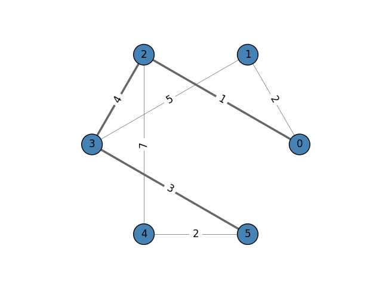

.. include:: ../../include/global.rst

.. _tutorials-shortest-paths:

==============
Shortest Paths
==============

.. _get_shortest_paths: https://igraph.org/python/doc/api/igraph._igraph.GraphBase.html#get_shortest_paths
.. |get_shortest_paths| replace:: :meth:`get_shortest_paths`
.. _get_all_shortest_paths: https://igraph.org/python/doc/api/igraph._igraph.GraphBase.html#get_all_shortest_paths
.. |get_all_shortest_paths| replace:: :meth:`get_all_shortest_paths`

This example demonstrates how to find the shortest distance between two vertices on a weighted and unweighted graph.

To find the shortest path or distance between two nodes, we can use |get_shortest_paths|_. If we're only interested in counting the unweighted distance, then we can do the following:

.. code-block:: python

    import igraph as ig
    import matplotlib.pyplot as plt

    # Find the shortest path on an unweighted graph
    g = ig.Graph(
        6,
        [(0, 1), (0, 2), (1, 3), (2, 3), (2, 4), (3, 5), (4, 5)]
    )

    # g.get_shortest_paths() returns a list of vertex ID paths
    results = g.get_shortest_paths(1, to=4, output="vpath")  # results = [[1, 0, 2, 4]]

    if len(results[0]) > 0:
        # The distance is the number of vertices in the shortest path minus one.
        print("Shortest distance is: ", len(results[0])-1)
    else:
        print("End node could not be reached!")

If the edges have weights, we pass them in as an argument. Note that we specify the output format as ``"epath"``, in order to receive the path as an edge list. This is used to calculate the length of the path.

.. code-block:: python

    # Find the shortest path on a weighted graph
    g.es["weight"] = [2, 1, 5, 4, 7, 3, 2]

    # g.get_shortest_paths() returns a list of edge ID paths
    results = g.get_shortest_paths(
        0,
        to=5,
        weights=g.es["weight"],
        output="epath",
    )
    # results = [[1, 3, 5]]

    if len(results[0]) > 0:
        # Add up the weights across all edges on the shortest path
        distance = 0
        for e in results[0]:
            distance += g.es[e]["weight"]
        print("Shortest weighted distance is: ", distance)
    else:
        print("End node could not be reached!")

The output of these these two shortest paths are:

.. code-block:: 

    Shortest distance is:  3
    Shortest weighted distance is:  8    

   The graph `g` with the shortest path from vertex 0 to vertex 5 highlighted.

.. note::

    - |get_shortest_paths|_ returns a list of lists becuase the `to` argument can also accept a list of vertex IDs. In that case, the shortest path to all each vertex is found and stored in the results array.
    - If you're interested in finding *all* shortest paths, take a look at |get_all_shortest_paths|_.

In case you are wondering how the visualization figure was done, here's the code:

.. code-block:: python

    import igraph as ig
    import matplotlib.pyplot as plt

    # Construct the graph
    g = ig.Graph(
        6,
        [(0, 1), (0, 2), (1, 3), (2, 3), (2, 4), (3, 5), (4, 5)]
    )
    g.es["weight"] = [2, 1, 5, 4, 7, 3, 2]

    # Get a shortest path along edges
    results = g.get_shortest_paths(
        0,
        to=5,
        weights=g.es["weight"],
        output="epath",
    )
    # results = [[1, 3, 5]]

    # Plot graph
    g.es['width'] = 0.5
    g.es[results[0]]['width'] = 2.5

    fig, ax = plt.subplots()
    ig.plot(
        g,
        target=ax,
        layout='circle',
        vertex_color='steelblue',
        vertex_label=range(g.vcount()),
        edge_width=g.es['width'],
        edge_label=g.es["weight"],
        edge_color='#666',
        edge_align_label=True,
        edge_background='white'
    )
