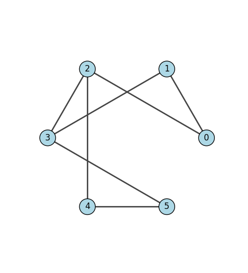

==============
Shortest Paths
==============

For finding the shortest path or distance between two nodes, we can use :meth:`get_shortest_paths()`. If we're only interested in counting the unweighted distance, then we use:

.. code-block:: python

    # Find the shortest path on an unweighted graph
    g = ig.Graph(
        6,
        [(0, 1), (0, 2), (1, 3), (2, 3), (2, 4), (3, 5), (4, 5)]
    )

    # g.get_shortest_paths() returns a list of vertex ID paths.
    # In this case, results = [[1, 0, 2, 4]], to indicate that the shortest
    # path goes through nodes 1 -> 0 -> 2 -> 4.
    results = g.get_shortest_paths(1, to=4, output="vpath")

    if len(results[0]) > 0:
        # Number of edges is the number of nodes in the shortest path minus one.
        print("Shortest distance is: ", len(results[0])-1)
    else:
        print("End node could not be reached")

...and if the edges have distances or weights associated with them, we pass them in as an argument. Also note that we specify the output format as ``"epath"``, in order to receive the path as an edge list which we can use to calculate the distance.

.. code-block:: python

    # Find the shortest path on a weighted graph
    g.es["weight"] = [2, 1, 5, 4, 7, 3, 2]

    # g.get_shortest_paths() returns a list of edge ID paths.
    # In this case, results = [[1, 3, 5]].
    results = g.get_shortest_paths(0, to=5, weights=g.es["weight"], output="epath")

    if len(results[0]) > 0:
        # Add up the weights across all edges on the shortest path.
        distance = 0
        for e in results[0]:
            distance += g.es[e]["weight"]
        print("Shortest distance is: ", distance)
    else:
        print("End node could not be reached")

   Graph ``g``, as seen in the examples.

    TODO: Currently, the develop branch is bugged so that I can't display edge weights on the sample figure. I'll find some time to generate a graph from Cairo instead later.

- If you're wondering why :meth:`get_shortest_paths` returns a list of lists, it's becuase the `to` argument can also accept a list of vertex IDs. In that case, the shortest path to all each vertex is found and stored in the results array.
- If you're interested in finding *all* shortest paths, check out :meth:`get_all_shortest_paths`.

