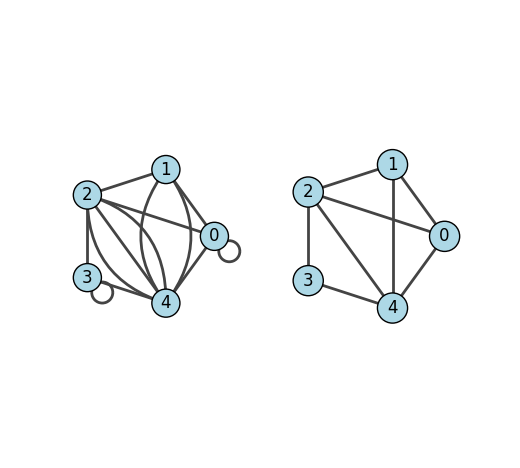

.. include:: ../../include/global.rst

.. _tutorials-simplify:

========
Simplify
========

.. _simplify: https://igraph.org/python/doc/api/igraph._igraph.GraphBase.html#simplify
.. |simplify| replace:: :meth:`simplify`

This example shows how to remove self loops and multiple edges using |simplify|_.

We start with a graph that includes loops and multiedges:

.. code-block:: python

    import igraph as ig
    import matplotlib.pyplot as plt

    # Generate graph with multiple edges and loops
    g1 = ig.Graph([
        (0, 1),
        (1, 2),
        (2, 3),
        (3, 4),
        (4, 0),
        (0, 0), 
        (1, 4),
        (1, 4),
        (0, 2),
        (2, 4),
        (2, 4),
        (2, 4),
        (3, 3)],
    )

To get rid of both loops and multiedges, we make a copy of the graph and simplify it in place:

.. code-block:: python

    # Generate simplified version of graph
    g2 = g1.copy()
    g2.simplify()

Finally, we check what happened by plotting both graphs:

.. code-block:: python

    # Plot graphs
    visual_style = {
        "vertex_color": "lightblue",
        "vertex_size": 0.4,
        "vertex_label": [0, 1, 2, 3, 4],
    }

    # Make twin axes
    fig, axs = plt.subplots(1, 2, sharex=True, sharey=True)
    # Plot graphs
    ig.plot(
        g1,
        layout="circle",
        target=axs[0],
        **visual_style,
    )
    ig.plot(
        g2,
        layout="circle",
        target=axs[1],
        **visual_style,
    )
    # Draw rectangles around axes
    axs[0].add_patch(plt.Rectangle(
        (0, 0), 1, 1, fc='none', ec='k', lw=4, transform=axs[0].transAxes,
        ))
    axs[1].add_patch(plt.Rectangle(
        (0, 0), 1, 1, fc='none', ec='k', lw=4, transform=axs[1].transAxes,
        ))
    # Set titles
    axs[0].set_title('Multigraph...')
    axs[1].set_title('...simplified')
    plt.show()

   The original graph (left) versus the simplified graph (right).
