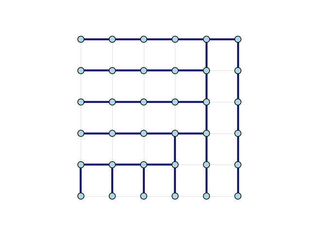

.. include:: ../../include/global.rst

.. _tutorials-spanning-trees:

==============
Spanning Trees
==============

.. _spanning_tree: https://igraph.org/python/doc/api/igraph.Graph.html#spanning_tree
.. |spanning_tree| replace:: :meth:`spanning_tree`

This example shows how to generate a spanning tree from an input graph using |spanning_tree|_. For the related idea of finding a *minimum spanning tree*, see :ref:`tutorials-minimum-spanning-trees`.

First we create a 6 by 6 lattice graph.

.. code-block:: python
    
    import igraph as ig
    import matplotlib.pyplot as plt
    import random

    g = ig.Graph.Lattice([6, 6], circular=False)

.. _permute_vertices: https://igraph.org/python/doc/api/igraph._igraph.GraphBase.html#permute_vertices
.. |permute_vertices| replace:: :meth:`permute_vertices`

As an optional step, we randomly rearrange some of the vertex IDs with |permute_vertices|_ in order to generate a more interesting spanning tree.

.. code-block:: python

    # Optional: Rearrange the vertex ids to get a more interesting spanning tree
    layout = g.layout("grid")

    random.seed(0)
    permutation = list(range(g.vcount()))
    random.shuffle(permutation)
    g = g.permute_vertices(permutation)

    # Calculate the new layout coordinates based on the permutation
    new_layout = g.layout("grid")
    for i in range(36):
        new_layout[permutation[i]] = layout[i]
    layout = new_layout

Finally, we generate the spanning tree and display it. Note that we use ``None`` as our weights value, to indicate that we any spanning tree in the graph will do.

.. code-block:: python
    
    # Generate spanning tree
    spanning_tree = g.spanning_tree(weights=None, return_tree=False)

    # Plot graph
    g.es["color"] = "lightgray"
    g.es[spanning_tree]["color"] = "midnightblue"
    g.es["width"] = 0.5
    g.es[spanning_tree]["width"] = 3.0

    fig, ax = plt.subplots()
    ig.plot(
        g,
        target=ax,
        layout=layout,
        vertex_color="lightblue",
        edge_width=g.es["width"]
    )
    plt.show()

The final plot looks like this:

   Spanning tree edges are bolded.
