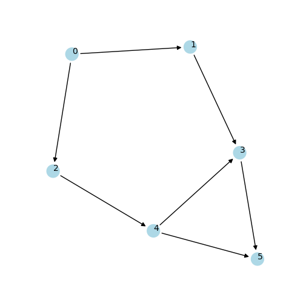

.. include:: ../../include/global.rst

.. _tutorials-topological-sort:

===================
Topological sorting
===================

.. _topological_sorting: https://igraph.org/python/doc/api/igraph._igraph.GraphBase.html#topological_sorting
.. |topological_sorting| replace:: :meth:`topological_sorting`

This example demonstrates how to get a topological sorting on a directed acyclic graph (DAG). A topological sorting of a directed graph is a linear ordering based on the precedence implied by the directed edges. It exists iff the graph doesn't have any cycle. In ``igraph``, we can use |topological_sorting|_ to get a topological ordering of the vertices.

.. code-block:: python

    import igraph as ig
    
    # generate a directed acyclic graph (DAG)
    g = ig.Graph(
        edges=[(0, 1), (0, 2), (1, 3), (2, 4), (4, 3), (3, 5), (4, 5)], 
        directed=True,
    )
    assert g.is_dag

    # g.topological_sorting() returns a list of node IDs
    # If the given graph is not DAG, the error will occur.
    results = g.topological_sorting(mode='out')
    print('Topological sort of g (out):', *results)

    results = g.topological_sorting(mode='in')
    print('Topological sort of g (in):', *results)

There are two modes of |topological_sorting|_. ``'out'`` is the default mode which starts from a node with indegree equal to 0. Vice versa, the mode ``'in'`` starts from a node with outdegree equal to 0.

The output of the code above is:

.. code-block::

    Topological sort of g (out): 0 1 2 4 3 5
    Topological sort of g (in): 5 3 1 4 2 0

We can use :meth:`indegree()` to find the indegree of the node.

.. code-block:: python

    import igraph as ig

    # generate directed acyclic graph (DAG)
    g = ig.Graph(edges=[(0, 1), (0, 2), (1, 3), (2, 4), (4, 3), (3, 5), (4, 5)], 
                directed=True)

    # g.vs[i].indegree() returns the indegree of the node.
    for i in range(g.vcount()):
        print('degree of {}: {}'.format(i, g.vs[i].indegree()))

    '''
    degree of 0: 0
    degree of 1: 1
    degree of 2: 2
    degree of 3: 3
    degree of 4: 4
    degree of 5: 5 
    '''

   The graph `g` with topological sorting.

We can easily plot our topologically sorted graph as follows:

.. code-block:: python

    import igraph as ig
    import matplotlib.pyplot as plt

    # generate a directed acyclic graph (DAG)
    g = ig.Graph(
        edges=[(0, 1), (0, 2), (1, 3), (2, 4), (4, 3), (3, 5), (4, 5)], 
        directed=True,
    )
    
    # visualization (use xkcd style for a different flavor)
    with plt.xkcd():
        fig, ax = plt.subplots(figsize=(5, 5))
        ig.plot(
                g,
                target=ax,
                layout='kk',
                vertex_size=0.3,
                edge_width=4,
                vertex_label=range(g.vcount()),
                vertex_color="white",
            )
