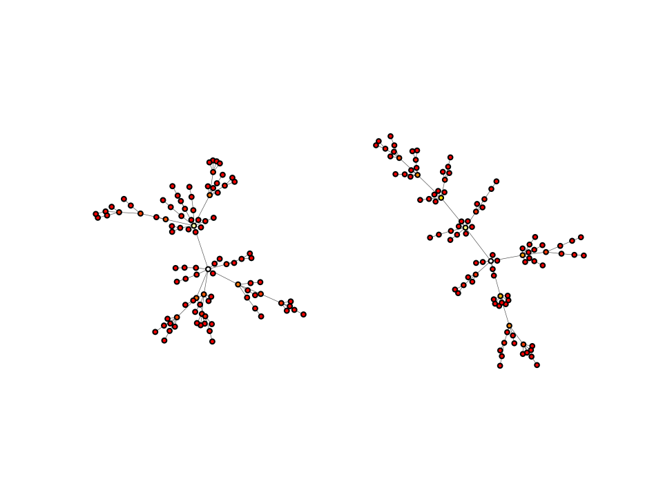

.. include:: ../../include/global.rst

.. _tutorials-visual-style:

=======================================
Plotting graphs with a consistent style
=======================================

This example shows how to use dictionary unpacking in order to easily use the same visual style across multiple graphs. This is a quick and easy way to quickly share a single visual style across multiple graphs, without having to copy and paste each of the individual attributes over and over again for each graph you plot.

.. code-block:: python

    import igraph as ig
    import matplotlib.pyplot as plt
    import math
    import random

    # Configure visual style
    visual_style = {
        "edge_width": 0.3,
        "vertex_size": 1.5,
        "palette": "heat",
        "layout": "fruchterman_reingold"
    }

    # Generate four random graphs
    random.seed(1)
    gs = [ig.Graph.Barabasi(n=30, m=1) for i in range(4)]

    # Calculate colors between 0-255 for all nodes
    betweenness = [g.betweenness() for g in gs]
    colors = [[int(i * 255 / max(btw)) for i in btw] for btw in betweenness]

    # Plot the graphs, using the same predefined visual style for both
    fig, axs = plt.subplots(2, 2)
    axs = axs.ravel()
    for g, color, ax in zip(gs, colors, axs):
        ig.plot(g, target=ax, vertex_color=color, **visual_style)
    plt.show()

The plots looks like this:

   Four graphs using the same palette and layout algorithm.

.. note::
    If you would like to set global defaults, for example, always using the Matplotlib plotting backend, or using a particular color palette by default, you can use |igraph|'s `configuration instance <https://igraph.org/python/doc/api/igraph.configuration.Configuration.html>`_. A quick example on how to use it can be found here: :ref:`tutorials-configuration`
