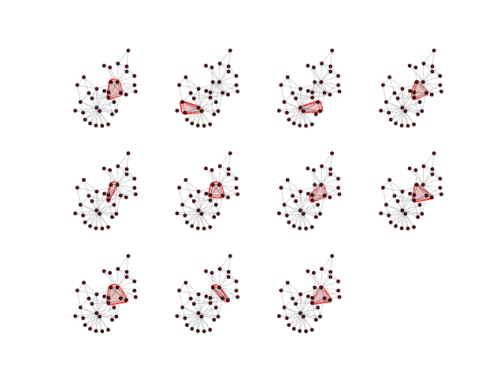
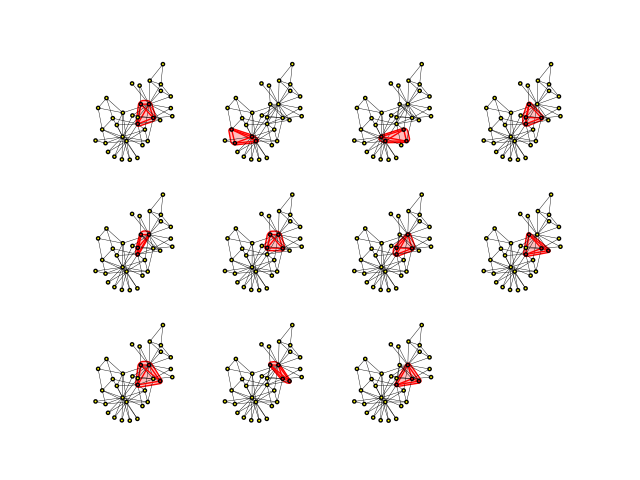

.. include:: ../../include/global.rst

.. _tutorials-cliques:

============
Cliques
============

.. _cliques: https://igraph.org/python/doc/api/igraph._igraph.GraphBase.html#cliques
.. |cliques| replace:: :meth:`cliques`

This example shows how to compute and visualize cliques of a graph using |cliques|_.

.. code-block:: python

   import igraph as ig
   import matplotlib.pyplot as plt
   
   g = ig.Graph.Famous('Zachary')
   
   # Compute cliques
   cliques = g.cliques(4, 4)
   
   # Plot each clique highlighted in a separate axes
   fig, axs = plt.subplots(3, 4)
   axs = axs.ravel()
   for clique, ax in zip(cliques, axs):
       ig.plot(
           ig.VertexCover(g, [clique]),
           mark_groups=True, palette=ig.RainbowPalette(),
           edge_width=0.5,
           target=ax,
       )
   
   plt.axis('off')
   plt.show()

The plot looks like this:

   Each clique of the graph is highlighted in one of the panels

Advanced: improving plotting style
----------------------------------
If you want a little more style, you can color the vertices/edges within each clique to make them stand out:

.. code-block:: python

    import igraph as ig
    import matplotlib.pyplot as plt
    
    g = ig.Graph.Famous('Zachary')
    cliques = g.cliques(4, 4)
    
    fig, axs = plt.subplots(3, 4)
    axs = axs.ravel()
    for clique, ax in zip(cliques, axs):
        # Color vertices yellow/red based on whether they are in this clique
        g.vs['color'] = 'yellow'
        g.vs[clique]['color'] = 'red'
    
        # Color edges black/red based on whether they are in this clique
        clique_edges = g.es.select(_within=clique)
        g.es['color'] = 'black'
        clique_edges['color'] = 'red'
        # also increase thickness of clique edges
        g.es['width'] = 0.3
        clique_edges['width'] = 1
    
        ig.plot(
            ig.VertexCover(g, [clique]),
            mark_groups=True,
            palette=ig.RainbowPalette(),
            target=ax,
        )
    
    plt.axis('off')
    plt.show()

Lo and behold:

   Each clique of the graph is highlighted in one of the panels, with vertices and edges highlighted as well.

