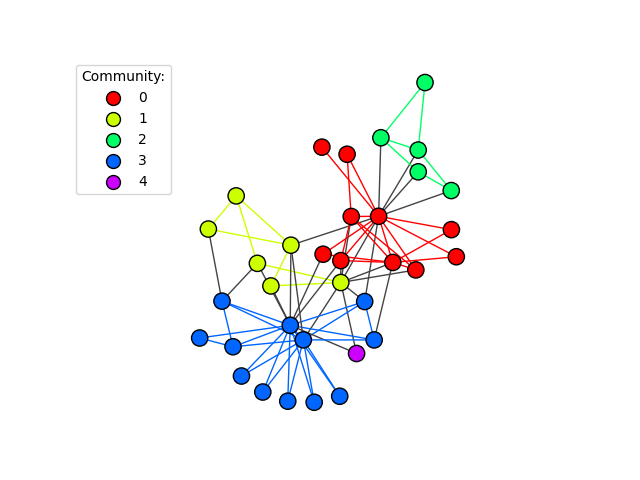

.. include:: ../../include/global.rst

.. _tutorials-visualize-communities:

=====================
Communities
=====================

This example shows how to visualize communities or clusters of a graph. First, make the graph: we just use a famous graph here for simplicity.

.. code-block:: python

    import igraph as ig
    import matplotlib.pyplot as plt
    
    g = ig.Graph.Famous("Zachary")

Second, define the clusters.

.. code-block:: python

    # Use edge betweenness to detect communities
    communities = g.community_edge_betweenness()
    # ... and convert into a VertexClustering for plotting
    communities = communities.as_clustering()

Third, prepare colors for the various communities:

.. code-block:: python

    # Color each vertex and edge based on its community membership
    num_communities = len(communities)
    palette = ig.RainbowPalette(n=num_communities)
    for i, community in enumerate(communities):
        g.vs[community]["color"] = i
        community_edges = g.es.select(_within=community)
        community_edges["color"] = i

Finally, plot the graph:

.. code-block:: python

    # Plot with only vertex and edge coloring
    fig, ax = plt.subplots()
    ig.plot(
        communities,
        palette=palette,
        edge_width=1,
        target=ax,
        vertex_size=0.3,
    )

... and add a fancy legend via `proxy artists`_:

.. _`proxy artists`: https://matplotlib.org/stable/tutorials/intermediate/legend_guide.html

.. code-block:: python

    legend_handles = []
    for i in range(num_communities):
        handle = ax.scatter(
            [], [],
            s=100,
            facecolor=palette.get(i),
            edgecolor="k",
            label=i,
        )
        legend_handles.append(handle)

    ax.legend(
        handles=legend_handles,
        title='Community:',
        bbox_to_anchor=(0, 1.0),
        bbox_transform=ax.transAxes,
    )

The resulting figure is shown below.

   The graph with its communities highlighted by color.

For an example on how to generate the cluster graph from a vertex cluster, check out :ref:`tutorials-cluster-graph`.
